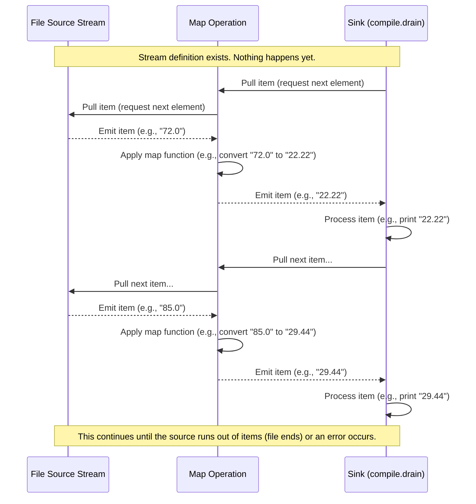

# Chapter 1: Stream

Welcome to the `fs2-examples` tutorial! This first chapter introduces the fundamental concept you'll encounter when working with FS2 and ZIO Streams: the **Stream**.

### What Problem Does a Stream Solve?

Imagine you have a huge file, maybe gigabytes big, and you need to read it line by line, process each line (like converting Fahrenheit to Celsius), and then write the results somewhere else.

Your first thought might be to read the whole file into memory using something like `scala.io.Source.fromFile("...")`, process the resulting `List` or `Iterator`, and then write it out. This works for small files.

```scala
// This is a common approach for small files (conceptually)
// import scala.io.Source // Don't run this, it's just an illustration

// val lines: List[String] = Source.fromFile("large_file.txt").getLines().toList // Might crash on large files!

// Process lines...
// val processedLines = lines.map(...)

// Write processed lines...
```

But what happens with that gigabyte file? Loading it entirely into a `List` might use up all your computer's memory and cause your program to crash! Even if it's just large (not huge), holding everything in memory might be inefficient.

What if the data isn't in a file at all, but arriving over a network connection, or being generated continuously, or coming from multiple sources at once? A simple `List` or `Vector` can't represent data that arrives *over time* or is potentially *infinite*.

This is where the **Stream** comes in.

### The Stream Analogy: A Conveyor Belt

Think of a Stream like a **conveyor belt**.

*   **Items (Data):** Pieces of data travel along the belt. These could be lines from a file, network packets, numbers, or anything else.
*   **The Belt (The Stream Definition):** The stream itself is the conveyor belt. It's not the data itself, but the *plan* or *definition* of how data will flow, where it comes from, and what happens to it.
*   **Stations (Operations):** You can have stations along the belt. These stations perform operations on the items as they pass by, like filtering out certain items (`filter`), transforming them (`map`), or grouping them.
*   **Starting the Belt (Running the Stream):** The conveyor belt doesn't move until you explicitly start it. Similarly, a Stream definition doesn't do anything until you "run" or "compile" it.
*   **The End (The Sink):** At the end of the belt, the items need to go somewhere. This is called a "sink" in streaming libraries. A sink consumes the items from the stream.

The key idea is that the data flows *through* the system *over time*, one item (or a few items) at a time. You don't need to have all the data available or in memory simultaneously.

### What Does a Stream Look Like in Code?

In libraries like FS2 and ZIO Streams, a stream is represented by a type, often called `Stream` or `ZStream`.

Here's a very simple example of defining a stream that emits a few numbers:

```scala
import fs2.Stream // For FS2

// Define a stream that will emit the numbers 1, 2, and 3
val mySimpleStream: Stream[cats.effect.IO, Int] = Stream.emits(Seq(1, 2, 3))

// Or emit them one by one:
val anotherSimpleStream: Stream[cats.effect.IO, Int] = Stream(1, 2, 3)

// Or emit a single value:
val singleValueStream: Stream[cats.effect.IO, String] = Stream.emit("hello")
```

*Don't worry about the `[cats.effect.IO, ...]` part for now!* We'll cover that in the next chapter, [Effects (IO/ZIO)](02_effects__io_zio__.md). For now, just focus on `Stream` and the data type it holds (like `Int` or `String`).

These lines of code *define* streams, but they don't *do* anything yet. It's like designing the conveyor belt without turning it on.

### Running the Stream

To actually make the stream *do* something – to turn the conveyor belt on and process the items – you need to "run" or "compile" it, usually into a "sink". A common way to just execute the stream for its side effects (like printing) is `compile.drain` (in FS2).

```scala
import cats.effect.IO
import cats.effect.unsafe.implicits.global // Usually this is handled by IOApp

// ... (previous simple stream definitions)

// To run mySimpleStream and print each element
val runStream = mySimpleStream.evalMap(i => IO(println(i))).compile.drain

// evalMap is like a station that performs an effect (like printing) for each item
// compile.drain runs the stream and discards the results, focusing on side effects

// Now, actually *execute* the effect defined by 'runStream'
// In a real application, this is often done inside 'IOApp.run'
// For demonstration:
// runStream.unsafeRunSync() // Don't do this in production code!

// Expected (side) output when run:
// 1
// 2
// 3
```
*(Note: The `.unsafeRunSync()` call is for simple demonstrations outside of a Cats Effect application's `IOApp.run`. Real applications manage execution differently, as seen in the example code files).*

We'll explore running streams and different types of sinks in more detail in [Stream Sinks and Running](05_stream_sinks_and_running_.md).

### Streams from Real Sources (File Example)

Streams are powerful because they can represent data coming from external sources, like files.

Look at the `Converter1.scala` example code provided:

```scala
// From src/main/scala/Converter1.scala
import cats.effect.{IO, IOApp}
import fs2.{Stream, text}
import fs2.io.file.{Files, Path} // Import necessary modules

// ... other code ...

val files: List[Path] =
  List(
    Path("testdata/fahrenheit.txt"), // read in
    Path("testdata/filenotfound.txt"), // error: file not found
    Path("testdata/fahrenheit2.txt") // read in
  )

val inout: List[Stream[IO, String]] = files.map { file =>
  Files[IO] // Use the Files[IO] module
    .readUtf8Lines(file) // This creates a Stream[IO, String]!
    // ... other operations like handleErrorWith, collect ...
}

// ... rest of Converter1
```

Here, `Files[IO].readUtf8Lines(file)` is the source of the stream. It creates a `Stream` that will emit `String` elements (each line from the file) one by one as they are read, *without* loading the entire file into memory at once. This is much more efficient for large files.

The `zioVersion/Converter1.scala` code shows the ZIO Streams equivalent:

```scala
// From src/main/scala/zioVersion/Converter1.scala
import zio.stream.* // Import ZStream
import zio.nio.file.{Files, Path} // Import necessary modules

// ... other code ...

def processFile(file: Path): UStream[Either[String, String]] =
  Files
    .lines(file) // This creates a ZStream[Throwable, String] (or similar)!
    // ... other operations like collect, catchAll ...
```
Again, `Files.lines(file)` creates a `ZStream` that emits lines one by one.

### Adding Stations: Stream Transformations

Once you have a stream, you can add "stations" (operations) to the conveyor belt to process the data. Common operations include `map`, `filter`, `collect`, `scan`, etc. These operations are chained together using methods on the `Stream` object.

Consider the `Converter1.scala` example again:

```scala
// From src/main/scala/Converter1.scala - snippet showing transformation
// ...
.collect { case Fahrenheit(double) => // This is a transformation
  f"${f2c(double)}%.2f" // Convert Double to formatted String
}
// ...
```

The `.collect { ... }` part is a transformation. It takes the stream of lines (`String`), tries to match them as Fahrenheit temperatures using the `Fahrenheit` extractor, and for successful matches, it transforms the `Double` into a formatted `String` (the Celsius value). Lines that don't match are simply dropped.

The `WindowedAverage.scala` example shows another transformation:

```scala
// From src/main/scala/WindowedAverage.scala - snippet showing scan
// ...
.scan(Vector.empty[Double]) { case (list, dub) => // This is another transformation
  (if list.size >= WINDOW then list.drop(1) else list) :+ dub // Build a sliding window
}
.filter(_.length >= WINDOW) // Keep only vectors with full window size
.map(li => li.sum / li.length) // Transform the vector into its average
// ...
```

These examples show how operations are chained. The output stream of one operation becomes the input stream for the next. This allows you to build complex data processing pipelines.

We will dive much deeper into the many types of stream transformations in [Stream Transformations](04_stream_transformations_.md).

### How Does It Work Under the Hood? (A Simple View)

When you "run" a stream, the system doesn't immediately load everything. It uses a mechanism often called "pull-based".

Think back to the conveyor belt: the sink at the end *pulls* items from the belt. The belt section before it *pulls* items from its source, and so on, all the way back to the original data source (like the file reader). The source only emits an item when something downstream is ready to receive it.

This "pull" mechanism is key to handling large or infinite streams efficiently and implementing something called "backpressure" (where a slow sink can automatically slow down the upstream source).

Here's a very simplified sequence diagram illustrating the pull mechanism for a stream reading from a file, mapping the lines, and then being consumed by a sink (like printing):



This diagram shows the basic flow: the Sink asks the Map for data, the Map asks the Source, the Source provides data, the Map transforms it and gives it to the Sink. This happens item by item.

### Streams vs. Collections (Lists, Vectors, etc.)

It's helpful to see how streams differ from traditional, in-memory collections:

| Feature          | Traditional Collections (List, Vector, etc.) | Streams (FS2 Stream, ZIO Stream)                     |
| :--------------- | :----------------------------------------- | :--------------------------------------------------- |
| **Processing**   | Batch (operate on the whole collection)    | Incremental (operate on items as they arrive)        |
| **Data Source**  | Data must be fully in memory               | Data can come from files, network, generators, etc.  |
| **Memory Usage** | Can be high (holds all data)               | Can be low (processes data item by item)             |
| **Potential Size** | Finite (limited by memory)                 | Potentially infinite                                 |
| **Evaluation**   | Usually eager or semi-lazy (like `Iterator`) | Lazy (nothing happens until run/compiled)            |
| **Resource Mgmt**| Manual (e.g., closing files)               | Integrated (handles resource cleanup automatically)  |

Streams are ideal when dealing with large datasets, infinite sequences, or data that arrives asynchronously over time.

### Streams in the Examples

You can see streams being used throughout the provided code examples:

*   `Converter1.scala` / `zioVersion/Converter1.scala`: Reading lines from a file, transforming them, writing results. The core is `Files[IO].readUtf8Lines(file)` / `Files.lines(file)` which produces a `Stream[IO, String]` / `ZStream[Throwable, String]`.
*   `EchoServer.scala`: Handling network connections. `clientSocket.reads` produces a `Stream` of bytes, which is then transformed into a stream of lines using pipes like `through(text.utf8.decode)` and `through(text.lines)`.
*   `QueueExample.scala` / `zioVersion/QueueExample.scala`: Communicating between concurrent tasks. `Stream.fromQueueUnterminated(queue)` / `ZStream.fromQueue(queue)` creates a stream that emits items as they are put into a queue by another task (a producer stream).

In each case, streams represent a flow of data that is processed sequentially or concurrently over time.

### Conclusion

In this chapter, we introduced the Stream as a fundamental concept for processing data incrementally over time. We used the conveyor belt analogy to understand its core components: items, the belt (definition), stations (operations), starting the belt (running), and the end (sink). We saw how simple streams are defined and briefly touched upon how streams can read from sources like files and how transformations are applied.

Streams are powerful because they allow you to handle large, potentially infinite, or time-sensitive data flows efficiently without holding everything in memory.

In the next chapter, we'll look at the `IO` (from Cats Effect) and `ZIO` types that appear in the stream definitions (`Stream[IO, ...]`, `ZStream[..., ...]`). These types are crucial for streams that interact with the real world (like reading files, printing to console, making network calls), which involves **Effects**.

[Effects (IO/ZIO)](02_effects__io_zio__.md)

---

<sub><sup>**References**: [[1]](https://github.com/fancellu/fs2-examples/blob/d19af876ffe7973e915074614767f092f9680874/src/main/scala/Converter1.scala), [[2]](https://github.com/fancellu/fs2-examples/blob/d19af876ffe7973e915074614767f092f9680874/src/main/scala/EchoServer.scala), [[3]](https://github.com/fancellu/fs2-examples/blob/d19af876ffe7973e915074614767f092f9680874/src/main/scala/QueueExample.scala), [[4]](https://github.com/fancellu/fs2-examples/blob/d19af876ffe7973e915074614767f092f9680874/src/main/scala/REPL.scala), [[5]](https://github.com/fancellu/fs2-examples/blob/d19af876ffe7973e915074614767f092f9680874/src/main/scala/WindowedAverage.scala), [[6]](https://github.com/fancellu/fs2-examples/blob/d19af876ffe7973e915074614767f092f9680874/src/main/scala/zioVersion/Converter1.scala), [[7]](https://github.com/fancellu/fs2-examples/blob/d19af876ffe7973e915074614767f092f9680874/src/main/scala/zioVersion/QueueExample.scala), [[8]](https://github.com/fancellu/fs2-examples/blob/d19af876ffe7973e915074614767f092f9680874/src/main/scala/zioVersion/REPL.scala), [[9]](https://github.com/fancellu/fs2-examples/blob/d19af876ffe7973e915074614767f092f9680874/src/main/scala/zioVersion/WindowedAverage.scala)</sup></sub>