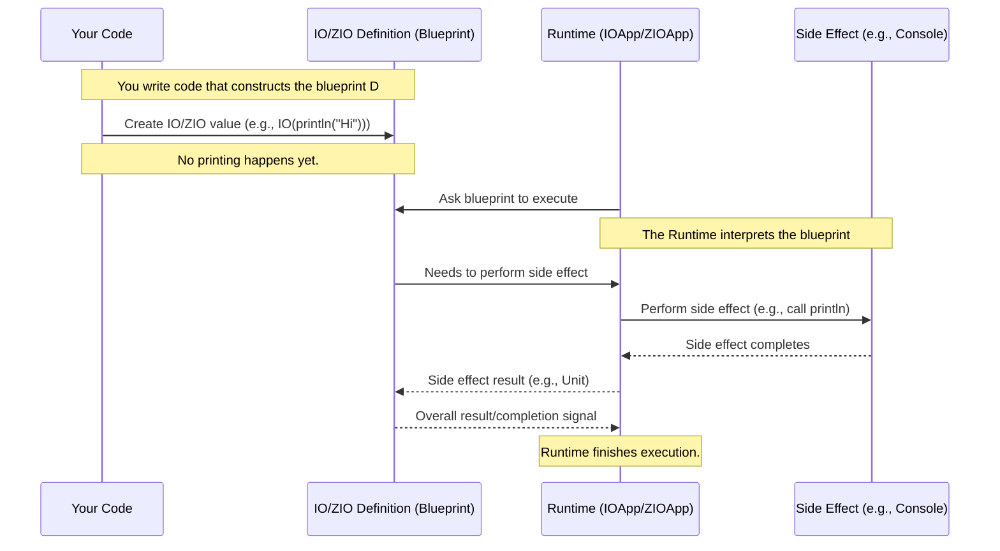

# Chapter 2: Effects (IO/ZIO)

Welcome back! In [Chapter 1: Stream](01_stream_.md), we learned that a `Stream` is like a conveyor belt, a blueprint for processing data incrementally. We saw examples like reading lines from a file (`Files[IO].readUtf8Lines`) or printing to the console (`through(stdout[IO]())`).

But did you notice that weird `[IO, ...]` part in the FS2 `Stream` type, or the first type parameter in the ZIO `ZStream` (like `ZStream[Throwable, String]`)? And what about methods like `evalMap` or `mapZIO` that seemed to do things like printing?

These are related to **Effects**, specifically represented by types like `IO` (from the Cats Effect library) and `ZIO` (from the ZIO library). This chapter explains what they are and why they are fundamental when your programs interact with the "real world".

### What Problem Do Effects (IO/ZIO) Solve?

Think about actions your program takes that aren't just calculations:

*   Reading a file from disk.
*   Writing data to the console.
*   Making a network request.
*   Generating a random number.
*   Getting the current time.

These are called **side effects**. They interact with the outside world or modify mutable state outside the function's scope.

Contrast this with a simple calculation:

```scala
def add(a: Int, b: Int): Int = a + b
```

This `add` function is "pure". Given the same inputs (a and b), it *always* produces the same output, and it doesn't do anything else (like printing or writing to a file).

Now consider printing:

```scala
def printHello(): Unit = println("Hello")
```

This function has a side effect: it prints to the console. If you call it multiple times, you see "Hello" multiple times.

In traditional Scala, when you define `printHello`, the `println` action happens *immediately* when `printHello()` is called. This is standard imperative programming.

The challenge with standard side effects in more complex applications, especially with concurrency or error handling, is that they happen *right away*, making it harder to:

1.  **Reason about the order:** When exactly will this happen?
2.  **Handle errors:** What if the file isn't found? How does that affect other parts of the program?
3.  **Compose operations:** How do you combine a file read, a network call, and a database write in a clean, reliable way?
4.  **Test:** How do you test code that talks to the network or file system without actually doing it?

This is where `IO` and `ZIO` come in.

### IO and ZIO: Blueprints, Not Actions

Instead of performing the side effect immediately, `IO` and `ZIO` types represent the *description* or *blueprint* of an action that *will* perform a side effect *later*.

Think of `IO` or `ZIO` as a **recipe**. A recipe describes how to bake a cake (the steps, the ingredients), but the recipe itself isn't the cake, and defining the recipe doesn't bake the cake immediately. You need to *follow* the recipe (run the effect) to get the cake (perform the action).

Let's see what this looks like:

```scala
import cats.effect.IO

// This line *defines* an IO action. It DOES NOT print immediately.
val printActionFS2: IO[Unit] = IO(println("Hello from FS2's IO!"))

// This line *defines* a ZIO action. It DOES NOT print immediately.
import zio.* // For ZIO and Console
val printActionZIO: Task[Unit] = Console.printLine("Hello from ZIO!") // Task is a type alias for ZIO[Any, Throwable, Unit]
```

In both examples, `printActionFS2` and `printActionZIO` are *values* (specifically, they are instances of `IO` and `ZIO`). They are like variables holding the recipe for printing "Hello...". Nothing happens until you explicitly "run" these recipes.

### Running the Effect

So, how do you "run" an `IO` or `ZIO` blueprint?

In your example code (`Converter1.scala`, `EchoServer.scala`, etc.), you'll see them extending `IOApp.Simple` (for Cats Effect/FS2) or `ZIOAppDefault` (for ZIO). These are special "runtimes" that know how to take your main `IO` or `ZIO` blueprint and execute it.

Look at `Converter1.scala`:

```scala
// From src/main/scala/Converter1.scala
import cats.effect.{IO, IOApp} // Imports IO and IOApp

object Converter1 extends IOApp.Simple: // We extend IOApp.Simple

  // ... converter definition (which is an IO[Unit]) ...

  def run: IO[Unit] = // This is the main blueprint
    converter.compile.drain // This is an IO[Unit] action
```

The `IOApp.Simple` trait provides the infrastructure to run the `IO[Unit]` value returned by the `run` method. When you execute the compiled application, the `IOApp.Simple` runtime automatically picks up your `run` method's `IO` value and executes it.

Similarly, in `zioVersion/Converter1.scala`:

```scala
// From src/main/scala/zioVersion/Converter1.scala
import zio.* // Imports ZIO and related things like ZIOAppDefault

object Converter1 extends ZIOAppDefault: // We extend ZIOAppDefault

  // ... converter definition (which is a ZIO value) ...

  def run = // This is the main blueprint
    for output <- converter.run(ZSink.foreach { ... }) // converter.run is the action here
    yield output // The result of the action
```

The `ZIOAppDefault` runtime executes the `ZIO` value returned by the `run` method.

For simple, standalone tests or examples (like in a REPL), you might see methods like `unsafeRunSync()` (Cats Effect) or `runForkEffect` (ZIO), but **avoid these in production code**. They bypass the safe and structured execution provided by the runtimes.

```scala
// Example for illustration ONLY, don't use in production!
import cats.effect.IO
import cats.effect.unsafe.implicits.global // Required to run outside IOApp

val unsafePrintAction: IO[Unit] = IO(println("This will run immediately when unsafeRunSync is called"))

// Calling this line actually performs the side effect
// unsafePrintAction.unsafeRunSync()
```
*(Again, `.unsafeRunSync()` and similar methods are generally not used in real applications built with these libraries. They are for quickly trying things in a REPL or simple scripts.)*

### Why Define Effects Instead of Running Them Immediately?

This separation of definition and execution is extremely powerful:

1.  **Explicit Side Effects:** Your function signatures (`IO[Unit]`, `Task[Unit]`, `Stream[IO, Int]`) clearly tell you when an operation involves a side effect. This makes code easier to read and understand.
2.  **Composability:** You can combine many `IO` or `ZIO` values into a single larger `IO` or `ZIO` value *without* executing any of them yet. This is like combining several recipes into one master recipe.
3.  **Control:** The runtime has control over *when* and *how* the effect is executed. This allows the library to handle things like:
    *   **Error Handling:** Gracefully catching and recovering from errors (more in [Error Handling](06_error_handling_.md)).
    *   **Resource Management:** Ensuring files are closed or network connections are shut down even if errors occur.
    *   **Concurrency:** Running multiple effects in parallel or managing shared resources (more in [Concurrency](07_concurrency_.md) and [Concurrency Primitives](08_concurrency_primitives__queue__ref__signallingref__.md)).
    *   **Cancellation:** Stopping a long-running effect if needed.

### How Effects Appear in Streams

Now let's connect this back to streams. When a stream operation needs to perform a side effect for each element it processes, it uses an `IO` or `ZIO`.

Look at the type signature of FS2's `Stream`: `Stream[F, O]`. `F` is the "effect type" (often `IO`), and `O` is the type of elements flowing in the stream. So, `Stream[IO, String]` means "a stream emitting `String` values, whose operations are described using the `IO` effect type."

When you want to perform an effect for each item in the stream, you use methods like `evalMap` (FS2) or `mapZIO` (ZIO Streams). These methods take a function that returns an `IO` or `ZIO`.

FS2 Example (`QueueExample.scala`):

```scala
// From src/main/scala/QueueExample.scala
// ... imports ...
import cats.effect.std._ // Imports Queue and Ref

// producer stream emits incrementing int every 100ms into queue
private def producer(queue: Queue[IO, Int]): Stream[IO, Nothing] =
  Stream
    .iterate(0)(_ + 1)
    .covary[IO] // Says this stream operates in the IO effect
    .metered(100.millis)
    .evalMap(i => IO.println(s"Producing $i") *> queue.offer(i)) // evalMap runs an IO for each element
    .drain // Discard the results of the IOs
```

Here, `evalMap` takes a function `Int => IO[Unit]` (or something similar). For each integer `i` from the stream, it defines an `IO` action (`IO.println(...) *> queue.offer(i)`). The stream then runs this `IO` action for each element.

ZIO Streams Example (`zioVersion/QueueExample.scala`):

```scala
// From src/main/scala/zioVersion/QueueExample.scala
// ... imports ...
import zio.* // For ZIO
import zio.stream.* // For ZStream

// producer stream emits incrementing int every 100ms into queue
private def producer(queue: Queue[Int]): UStream[Nothing] = // UStream is ZStream[Any, Nothing, Nothing]
  ZStream
    .iterate(0)(_ + 1)
    .schedule(Schedule.spaced(100.milliseconds))
    .mapZIO(i => Console.printLine(s"Producing $i").ignore *> queue.offer(i)) // mapZIO runs a ZIO for each element
    .drain
```

Similarly, `mapZIO` takes a function `Int => ZIO[R, E, A]` (or something similar). For each integer `i`, it defines a `ZIO` action (`Console.printLine(...) *> queue.offer(i)`). The ZIO stream then runs this `ZIO` action for each element.

Using `evalMap` or `mapZIO` is how you perform side effects *within* a stream processing pipeline, element by element.

You'll also see `IO` or `ZIO` used when creating streams from sources that *are* side effects, like reading files:

FS2 Example (`Converter1.scala`):

```scala
// From src/main/scala/Converter1.scala
import fs2.io.file.{Files, Path}

Files[IO] // This gives you a way to create file effects in IO
  .readUtf8Lines(Path("testdata/fahrenheit.txt")) // This method *returns* a Stream[IO, String] blueprint
```

ZIO Example (`zioVersion/Converter1.scala`):

```scala
// From src/main/scala/zioVersion/Converter1.scala
import zio.nio.file.{Files, Path}

Files
  .lines(Path("testdata/fahrenheit.txt")) // This method *returns* a ZStream[Throwable, String] blueprint
```

In both cases, the act of reading the file lines is an effect, so the resulting stream is "infused" with that effect type (`IO` or `Throwable` error type in ZIO's case).

### Under the Hood: The Runtime

How does this "blueprint" execution work? When the runtime (like `IOApp.Simple` or `ZIOAppDefault`) takes your final `IO` or `ZIO` value (the one from your `run` method), it walks through the steps described by the blueprint.

Here's a simplified sequence:



The key is that the `IO` or `ZIO` value itself is just data describing the computation. The `Runtime` is the active component that reads this data and actually performs the necessary operations, including the side effects. This allows the runtime to insert its own logic (like error handling, resource cleanup) around the side effects.

### IO vs. ZIO: A Note

You'll notice the FS2 examples use `IO` from Cats Effect, while the ZIO Streams examples use `ZIO` from the ZIO library. They serve a similar core purpose (representing effects) but are part of different ecosystems with different features and APIs. This tutorial covers both because FS2 is commonly used with Cats Effect, and ZIO Streams is part of the ZIO ecosystem. The fundamental idea of representing effects explicitly is the same.

### Conclusion

In this chapter, we introduced `IO` and `ZIO` as types that represent side-effecting operations without executing them immediately. They act as blueprints that are later executed by a runtime. This explicit management of effects is a cornerstone of building robust, composable, and testable applications in functional programming styles in Scala.

We saw how these effect types are integrated into `Stream` definitions and operations like `evalMap` or `mapZIO` to perform side effects item by item.

Understanding `IO` and `ZIO` is crucial for working with streams that interact with the outside world. In the next chapter, we'll put this into practice by focusing on a common real-world interaction: [File I/O](03_file_i_o_.md).

[File I/O](03_file_i_o_.md)

---

<sub><sup>**References**: [[1]](https://github.com/fancellu/fs2-examples/blob/d19af876ffe7973e915074614767f092f9680874/src/main/scala/Converter1.scala), [[2]](https://github.com/fancellu/fs2-examples/blob/d19af876ffe7973e915074614767f092f9680874/src/main/scala/EchoServer.scala), [[3]](https://github.com/fancellu/fs2-examples/blob/d19af876ffe7973e915074614767f092f9680874/src/main/scala/QueueExample.scala), [[4]](https://github.com/fancellu/fs2-examples/blob/d19af876ffe7973e915074614767f092f9680874/src/main/scala/REPL.scala), [[5]](https://github.com/fancellu/fs2-examples/blob/d19af876ffe7973e915074614767f092f9680874/src/main/scala/WindowedAverage.scala), [[6]](https://github.com/fancellu/fs2-examples/blob/d19af876ffe7973e915074614767f092f9680874/src/main/scala/zioVersion/Converter1.scala), [[7]](https://github.com/fancellu/fs2-examples/blob/d19af876ffe7973e915074614767f092f9680874/src/main/scala/zioVersion/QueueExample.scala), [[8]](https://github.com/fancellu/fs2-examples/blob/d19af876ffe7973e915074614767f092f9680874/src/main/scala/zioVersion/REPL.scala), [[9]](https://github.com/fancellu/fs2-examples/blob/d19af876ffe7973e915074614767f092f9680874/src/main/scala/zioVersion/WindowedAverage.scala)</sup></sub>