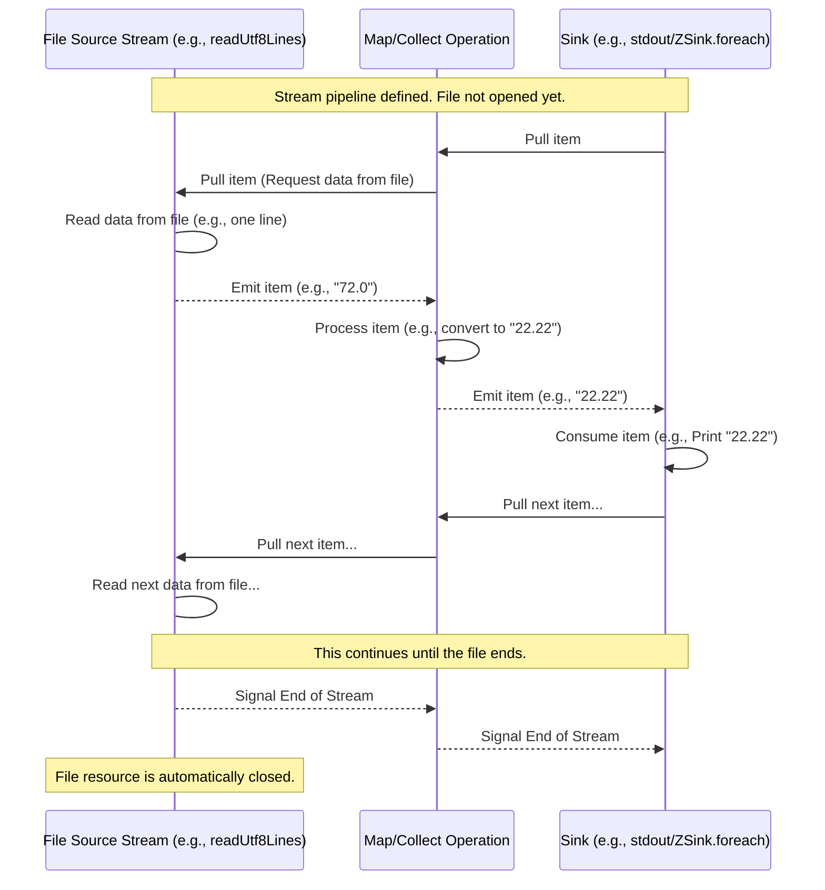

# Chapter 3: File I/O

Welcome back! In [Chapter 1: Stream](01_stream_.md), we introduced the idea of a stream as a conveyor belt for processing data incrementally. In [Chapter 2: Effects (IO/ZIO)](02_effects__io_zio__.md), we learned how `IO` and `ZIO` types represent actions that interact with the real world, like printing to the console or reading from a file.

Now, let's put these concepts together to tackle a very common real-world task: reading and processing data from files.

### What Problem Does Streaming File I/O Solve?

Imagine you have a large file containing data you need to process – maybe sensor readings, log entries, or a list of temperatures like in our example code.

The simplest way to read a file in many programming languages is to load its entire content into memory.

```scala
// Traditional approach (conceptually)
// import scala.io.Source // Don't run this, it's just an illustration

// val allLines: List[String] = Source.fromFile("large_data.txt").getLines().toList
// // Now process the 'allLines' list

// This works for small files, but what about gigabytes?
// Your program might run out of memory (crash!) trying to store everything at once.
```

This "load everything" approach is problematic for large files because it uses a lot of memory. Also, what if the file isn't static, but is being written to as your program runs? Or what if you want to start processing the beginning of the file before the end is even available?

Streams offer a much better way to handle file input: they allow you to process the file's content bit by bit, as it's being read.

### File I/O with Streams: The File as a Source

With streams, interacting with a file is like connecting the start of your conveyor belt directly to the file itself. The file reader becomes a **source stream** that emits data items (like lines or chunks of bytes) one by one as you need them.

The beauty of this approach is that you don't need to hold the entire file's content in memory at any point. The stream library handles reading from the file and pushing items onto the belt as needed.

### Key Tools for File Reading

Both FS2 and ZIO Streams provide modules specifically for interacting with the file system.

For reading files line by line, the most common methods are:

*   **FS2:** `fs2.io.file.Files[F].readUtf8Lines(path)`
*   **ZIO Streams:** `zio.nio.file.Files.lines(path)`

Let's look at how these are used in our example code.

### Example: Reading Lines with FS2

In `src/main/scala/Converter1.scala` and `src/main/scala/WindowedAverage.scala`, you'll find code like this:

```scala
// From src/main/scala/Converter1.scala or WindowedAverage.scala
import fs2.io.file.{Files, Path} // Need these imports
import cats.effect.IO // And the effect type

val filePath = Path("testdata/fahrenheit.txt")

// This line DEFINES a stream that will read lines from the file
val fileStream: Stream[IO, String] =
  Files[IO] // Use the Files module associated with IO
    .readUtf8Lines(filePath) // Returns a Stream[IO, String]
```

This code is similar in both examples. `Files[IO].readUtf8Lines(filePath)` creates a `Stream[IO, String]`. Let's break down that type signature:

*   `Stream`: We know this is the conveyor belt blueprint.
*   `[IO, String]`: This tells us two things:
    *   `IO`: The operations within this stream (specifically, reading from the file) involve side effects managed by the `IO` effect type (from Cats Effect).
    *   `String`: The items travelling on this stream will be `String`s (each `String` represents one line from the file).

Remember from [Chapter 2: Effects (IO/ZIO)](02_effects__io_zio__.md), this line *defines* the action; it doesn't actually open the file or read anything until the stream is `compile`d and `run` (which happens later in the `run` method via `converter.compile.drain` or `averager.compile.drain`).

### Example: Reading Lines with ZIO Streams

In `src/main/scala/zioVersion/Converter1.scala` and `src/main/scala/zioVersion/WindowedAverage.scala`, the equivalent code looks like this:

```scala
// From src/main/scala/zioVersion/Converter1.scala or WindowedAverage.scala
import zio.stream.* // Need ZStream
import zio.nio.file.{Files, Path} // Need these imports

val filePath = Path("testdata/fahrenheit.txt")

// This line DEFINES a stream that will read lines from the file
val fileStream: ZStream[Any, Throwable, String] =
  Files // Use the ZIO Files module
    .lines(filePath) // Returns a ZStream[R, E, String]
```

Here, `Files.lines(filePath)` creates a `ZStream[Any, Throwable, String]`:

*   `ZStream`: The ZIO Streams conveyor belt blueprint.
*   `[Any, Throwable, String]`: ZIO Stream type parameters are `[R, E, O]`:
    *   `R` (`Any`): The environment required (in this simple case, none specific).
    *   `E` (`Throwable`): The type of errors that can occur (like `java.io.IOException` if the file doesn't exist).
    *   `O` (`String`): The type of items flowing in the stream (`String` for each line).

Again, this only defines the stream. The file reading happens when the stream is `run`.

### Processing the Lines

Once you have a stream of lines from the file, you can apply any stream transformations you need.

Look at `Converter1.scala` again. After `Files[IO].readUtf8Lines(file)`, the stream is transformed:

```scala
// Snippet from src/main/scala/Converter1.scala
// ... from previous snippet
.handleErrorWith(handleError) // If reading the file fails, handle it here
.collect { case Fahrenheit(double) => // Process each line
  f"${f2c(double)}%.2f" // Convert Fahrenheit to Celsius string
}
// ... more transformations ...
```

*   `.handleErrorWith`: This is an error handling station. If the `readUtf8Lines` operation (or anything before it) fails (e.g., file not found), this handles that error. We'll cover error handling in [Error Handling](06_error_handling_.md).
*   `.collect`: This is a transformation station. For each line (`String`) from the file, it tries to apply the `Fahrenheit` extractor (which converts a valid number string to a `Double`). If successful, it transforms the `Double` (Fahrenheit) into a new `String` (formatted Celsius). Lines that don't match `Fahrenheit` are simply dropped from the stream.

This is the core idea: the file reader starts the stream, and then you chain operations to process the data line by line.

The ZIO Streams `Converter1.scala` follows a similar pattern:

```scala
// Snippet from src/main/scala/zioVersion/Converter1.scala
// ... from previous snippet
.collect { case Fahrenheit(double) => // Process each line
  Right(f"${f2c(double)}%.2f") // Convert, wrap in Right (for success)
}
.catchAll(error => // Handle errors
  ZStream.succeed(Left(s"Error: ${error.getMessage})")) // Emit an error message as a Left
)
// ... more transformations ...
```

It uses `.collect` to parse and convert valid lines (wrapping successful results in `Right`) and `.catchAll` to handle errors by emitting an error message wrapped in `Left`.

We'll learn much more about these kinds of transformations in [Chapter 4: Stream Transformations](04_stream_transformations_.md).

### Writing to Files (Briefly)

While our main examples focus on reading, stream libraries also provide ways to write data to files. This usually involves having a stream of bytes or strings and piping it *to* a file sink provided by the file I/O module.

For example, in FS2, you might use `through(Files[IO].writeUtf8(outputPath))`. This treats the file as a destination (a sink) for the stream's data.

### How Streaming File I/O Works Under the Hood (Simplified)

Let's revisit the conveyor belt and pull-based mechanism from [Chapter 1: Stream](01_stream_.md) in the context of file reading.

1.  **Stream Definition:** You define the stream pipeline, starting with a file source (`Files.readUtf8Lines` or `Files.lines`). This is just a blueprint.
2.  **Running the Stream:** When you run the stream (e.g., using `compile.drain` or `run(ZSink...)`), the sink at the end is ready to receive items.
3.  **Pulling Data:** The sink *pulls* for an item from the stream operation just before it. That operation, in turn, *pulls* from the file source.
4.  **Reading from File:** The file source receives the pull request. It reads a small chunk of data from the file (e.g., up to the next newline character for line-based reading), wraps it as an item (a `String`), and emits it downstream.
5.  **Processing:** The item travels downstream, passing through any transformation stations (`collect`, `map`, `filter`, etc.), until it reaches the sink.
6.  **Consumption:** The sink processes the item (e.g., prints it to the console).
7.  **Repeat:** The sink immediately pulls for the *next* item, and the process repeats.

This continues until the file source reaches the end of the file, at which point it signals completion downstream.

Here's a simple sequence diagram:



**Resource Management:** A crucial benefit is that the stream library automatically handles opening and closing the file resource. Even if an error occurs while processing the stream, the file handle will be properly closed. This is part of the resource management capabilities provided by the underlying effect systems (`IO` and `ZIO`).

### Streaming vs. Loading for File I/O

Let's summarize the difference for file processing:

| Feature          | Loading Entire File (e.g., `Source.getLines().toList`) | Streaming File I/O (e.g., `Files.readUtf8Lines`) |
| :--------------- | :----------------------------------------------------- | :----------------------------------------------- |
| **Memory Usage** | High (holds all data)                                  | Low (processes data piece by piece)              |
| **File Size**    | Limited by available memory                            | Virtually unlimited                              |
| **Processing**   | Process *after* reading is complete                    | Process *as* reading happens                     |
| **Responsiveness**| Can be slow to start processing (waits for full read)| Starts processing immediately                    |
| **Resource Mgmt**| Often requires manual `try/finally` for closing      | Automatic resource management built-in           |
| **Error Handling**| Reading error might require separate handling from processing errors | Integrated into the stream pipeline              |

For most real-world applications dealing with files, especially potentially large ones, the streaming approach is significantly more robust and efficient.

### File I/O in the Examples

You've seen how `Converter1.scala` and `WindowedAverage.scala` (both FS2 and ZIO versions) start their processing pipelines by creating a stream from a file using `Files.readUtf8Lines` or `Files.lines`. This establishes the source of the stream.

The subsequent steps in these examples (`collect`, `map`, `scan`, etc.) are stream transformations that process the data items (lines or numbers) flowing from that file source.

### Conclusion

Reading files with streams is a fundamental pattern. By treating the file as a source that emits data items over time, you can process datasets of any size efficiently, without overwhelming memory. The stream libraries provide simple, expressive methods like `readUtf8Lines` and `lines` to create these file source streams, and they handle the complexities of reading and resource management for you.

Now that we know how to get data *into* a stream from a file, the next step is to learn the various ways you can process, transform, and filter that data as it flows through the pipeline. That's the topic of our next chapter!

[Stream Transformations](04_stream_transformations_.md)

---

<sub><sup>**References**: [[1]](https://github.com/fancellu/fs2-examples/blob/d19af876ffe7973e915074614767f092f9680874/src/main/scala/Converter1.scala), [[2]](https://github.com/fancellu/fs2-examples/blob/d19af876ffe7973e915074614767f092f9680874/src/main/scala/WindowedAverage.scala), [[3]](https://github.com/fancellu/fs2-examples/blob/d19af876ffe7973e915074614767f092f9680874/src/main/scala/zioVersion/Converter1.scala), [[4]](https://github.com/fancellu/fs2-examples/blob/d19af876ffe7973e915074614767f092f9680874/src/main/scala/zioVersion/WindowedAverage.scala)</sup></sub>