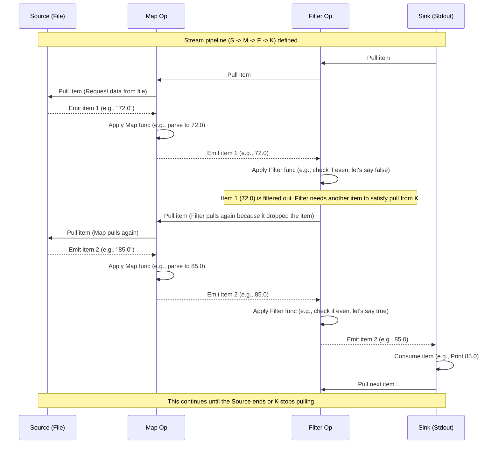

# Chapter 4: Stream Transformations

Welcome back! In [Chapter 1: Stream](01_stream_.md), we learned that a stream is like a conveyor belt carrying data items. In [Chapter 2: Effects (IO/ZIO)](02_effects__io_zio__.md), we saw how `IO` and `ZIO` handle the messy details of interacting with the real world. And in [Chapter 3: File I/O](03_file_i_o_.md), we learned how to use streams to efficiently get data *from* a file, treating the file as the start of our conveyor belt.

Now that we have data flowing, what do we do with it? The raw data from a source (like lines from a file) is rarely in the exact format we need for our final task. We need to process, change, or filter it. This is where **Stream Transformations** come in.

### What Problem Do Stream Transformations Solve?

Imagine the items are moving along your conveyor belt (the stream) after being read from a file. You might need to:

*   Change the format of each item (e.g., convert a string "72.0" into a number `72.0`).
*   Get rid of items you don't care about (e.g., skip comment lines or invalid data).
*   Combine multiple items together to produce a new item (e.g., calculate a running average of numbers).
*   Turn a single item into multiple new items (e.g., split a line of text into individual words).

Stream transformations are the "stations" you place along the conveyor belt. Each station takes items as they arrive, does something to them, and then puts the modified (or filtered, or new) items back onto the belt for the next station.

The important thing is that, just like the stream itself, transformations operate *incrementally*. They process items one by one (or in small groups), without needing the entire stream's data in memory at once.

Let's look at some of the most common and useful transformation stations.

### Common Transformation Stations

Here are some fundamental stream transformations you'll use frequently:

#### `map`: Changing Each Item

The `map` transformation applies a simple function to every item in the stream, producing a new stream where each item is the result of applying the function.

Analogy: A station that repaints every item flowing by.

```scala
import fs2.Stream
import cats.effect.IO

// A stream of numbers
val numbers: Stream[IO, Int] = Stream(1, 2, 3)

// Apply a map transformation to convert each number to a string
val strings: Stream[IO, String] = numbers.map(i => s"Number: $i")

// If you were to run this stream and print, you'd see:
// Number: 1
// Number: 2
// Number: 3
```

In this FS2 example, `map` takes a function `Int => String`. It gets an `Int` from the upstream, applies the function `i => s"Number: $i"` to it, and emits the resulting `String` downstream. The ZIO Streams `map` works the same way, applying a function `O => O2` where `O` is the input item type and `O2` is the output type.

#### `filter`: Keeping Only Certain Items

The `filter` transformation keeps only the items that satisfy a given condition (a function that returns `true` or `false`). Items for which the condition returns `false` are simply dropped from the stream.

Analogy: A quality control station that removes defective items from the belt.

```scala
import fs2.Stream
import cats.effect.IO

// A stream of numbers
val numbers: Stream[IO, Int] = Stream(1, 2, 3, 4, 5, 6)

// Apply a filter transformation to keep only even numbers
val evenNumbers: Stream[IO, Int] = numbers.filter(i => i % 2 == 0)

// If you were to run this stream and print, you'd see:
// 2
// 4
// 6
```

Here, `filter` takes a function `Int => Boolean`. For each `Int` item, it checks if `i % 2 == 0` is true. If it is, the `Int` is passed downstream; otherwise, it's discarded. ZIO Streams `filter` is similar, taking a function `O => Boolean`.

#### `collect`: Filtering and Transforming

The `collect` transformation is a powerful combination of `filter` and `map` using a Scala `PartialFunction`. It processes items for which the `PartialFunction` is defined, applying the function and emitting the result. Items for which the `PartialFunction` is *not* defined are dropped.

Analogy: A station that identifies specific types of items (like fruit) and transforms them (e.g., puts them in a basket), while ignoring everything else (like rocks).

This is heavily used in `Converter1.scala` and `zioVersion/Converter1.scala` to handle parsing lines:

```scala
// Snippet from Converter1.scala or zioVersion/Converter1.scala (simplified)
// import fs2.Stream; import cats.effect.IO; // or zio equivalents
// import scala.util.Try
// object Fahrenheit { // ... unapply method from example ... }

// Assume 'lines' is a Stream[IO, String] (or ZStream[..., String]) from a file

val numbersStream = lines.collect {
  case Fahrenheit(double) => // Try to match the line using Fahrenheit extractor
    double // If match succeeds, emit the Double
}

// Items that don't match the Fahrenheit case (empty lines, comments, invalid strings) are dropped.
// Valid Fahrenheit strings like "72.5" are transformed into Double values like 72.5.
```

The `PartialFunction` `case Fahrenheit(double) => double` is applied to each `String` item. If the `Fahrenheit` extractor successfully matches the string and gives back a `Double`, that `Double` is emitted. If it doesn't match, the original `String` item is dropped.

#### `scan`: Aggregating Items Over Time

The `scan` transformation is used for stateful computations. It takes an initial state value and a function that updates the state based on the current state and the incoming item. It emits the *new state* for every incoming item. This is perfect for calculating running totals, averages, or building up collections.

Analogy: A station that keeps a running tally or builds a package step by step as items arrive.

The `WindowedAverage.scala` and `zioVersion/WindowedAverage.scala` examples use `scan` to build a sliding window of temperatures:

```scala
// Snippet from WindowedAverage.scala or zioVersion/WindowedAverage.scala (simplified)
// import fs2.Stream; import cats.effect.IO; // or zio equivalents
// Assume 'numbers' is a Stream[IO, Double] (or ZStream[..., Double])

val WINDOW = 5

// scan starts with an empty Vector[Double]
// for each incoming 'dub' (a Double), it updates the Vector
// If the vector is full (>= WINDOW size), it drops the oldest element (drop(1))
// then adds the new element (:+ dub)
val windowedNumbers: Stream[IO, Vector[Double]] = numbers.scan(Vector.empty[Double]) {
  case (list, dub) =>
    (if list.size >= WINDOW then list.drop(1) else list) :+ dub
}

// The stream now emits Vector[Double] values, representing the sliding window.
// Example emits: Vector(d1), Vector(d1, d2), ..., Vector(d1..d5), Vector(d2..d6), ...
```

The stream produced by this `scan` emits a `Vector[Double]` for *every* incoming `Double`. The `Vector` changes with each new item. This lets you track the state (the current window of numbers) as the stream progresses.

#### `flatMap`: Turning One Item into Many (or Zero)

The `flatMap` transformation is similar to `map`, but the function it applies to each item must return *another stream*. `flatMap` then flattens these resulting streams together into a single output stream. This is useful when processing one item might result in multiple pieces of data.

Analogy: A station that can take one large item and break it down into multiple smaller items, which are then all put back on the belt.

```scala
import fs2.Stream
import cats.effect.IO

// A stream of sentences
val sentences: Stream[IO, String] = Stream("Hello world", "FS2 is great")

// Use flatMap to split each sentence into words
// For each sentence (String), the function produces a Stream of Words (String)
// flatMap then merges these word streams into one stream of words.
val words: Stream[IO, String] = sentences.flatMap { sentence =>
  Stream.emits(sentence.split(" ").toSeq) // sentence.split produces an Array, convert to Seq for emits
}

// If you were to run this stream and print, you'd see:
// Hello
// world
// FS2
// is
// great
```

Here, for the item `"Hello world"`, the function `sentence => Stream.emits(sentence.split(" ").toSeq)` produces `Stream("Hello", "world")`. For `"FS2 is great"`, it produces `Stream("FS2", "is", "great")`. `flatMap` takes these individual streams and joins them sequentially into one stream: `Stream("Hello", "world", "FS2", "is", "great")`.

#### `through`: Applying a `Pipe`

Sometimes you have a sequence of transformations that you want to package up and reuse. In FS2, this is done using a `Pipe`. A `Pipe[F, I, O]` is simply a function that takes a `Stream[F, I]` and returns a `Stream[F, O]`. The `through` method on `Stream` is used to apply a `Pipe`.

Analogy: A complex, pre-built machine you can drop onto the conveyor belt. It might do several internal steps, but from the outside, it just takes items of type `I` and outputs items of type `O`.

You see `through` used frequently with built-in FS2 pipes for encoding/decoding text or interacting with I/O:

```scala
// Snippet from Converter1.scala (FS2) or EchoServer.scala (FS2)
// import fs2.Stream; import cats.effect.IO; import fs2.text; import fs2.io.stdout

// Assume 'lines' is a Stream[IO, String]
val encodedBytes: Stream[IO, Byte] = lines.through(text.utf8.encode)

// Now 'encodedBytes' is a Stream[IO, Byte]. Apply another pipe to write to stdout.
val printAction: Stream[IO, Unit] = encodedBytes.through(stdout[IO]())

// Chaining:
// stream of Strings -> Pipe[IO, String, Byte] -> stream of Bytes -> Pipe[IO, Byte, Unit] -> stream of Units (side effect happens)
```

The `text.utf8.encode` is a `Pipe[IO, String, Byte]`. It takes a stream of `String` and produces a stream of `Byte` (the UTF-8 encoded version). `stdout[IO]()` is a `Pipe[IO, Byte, Unit]` that takes a stream of `Byte` and writes them to standard output, producing a stream of `Unit` (representing the completion of the write effect).

ZIO Streams has a similar concept; many operations you might chain together could conceptually be thought of as pipes, although the `Pipe` type itself is less central than in FS2. You'll see `ZPipeline` in ZIO Streams for reusable transformation sequences.

### Chaining Transformations

The power of stream transformations comes from chaining them together. The output stream of one transformation becomes the input stream for the next.

Consider the `WindowedAverage.scala` example pipeline:

```scala
// Snippet from WindowedAverage.scala (FS2)
Files[IO]
  .readUtf8Lines(Path("testdata/fahrenheit.txt")) // Stream[IO, String] - Source
  .handleErrorWith(...)                       // Stream[IO, String] - Handles errors
  .collect { case Fahrenheit(double) => double } // Stream[IO, Double] - Filters/Parses String to Double
  .scan(Vector.empty[Double]) { ... }         // Stream[IO, Vector[Double]] - Builds window Vector
  .filter(_.length >= WINDOW)                 // Stream[IO, Vector[Double]] - Keeps only full windows
  .map(li => li.sum / li.length)              // Stream[IO, Double] - Transforms Vector to its average (Double)
  .map(_.toString)                            // Stream[IO, String] - Transforms Double average to String
  .intersperse("\n")                          // Stream[IO, String] - Adds newlines between averages
  .through(text.utf8.encode)                  // Stream[IO, Byte] - Encodes String to Byte
  .through(stdout[IO]())                      // Stream[IO, Unit] - Writes Bytes to console (Sink)
```

This shows a pipeline with multiple transformation stations:
1.  Read lines (`String`).
2.  Handle errors (still `String` or error).
3.  Filter/parse into `Double` numbers.
4.  `scan` builds `Vector[Double]` windows.
5.  `filter` keeps only "full" `Vector` windows.
6.  `map` calculates the average `Double` from the `Vector`.
7.  `map` converts the average `Double` back to a `String`.
8.  `intersperse` adds newlines between the `String` averages.
9.  `through` encoding pipe turns `String` into `Byte`.
10. `through` stdout pipe consumes `Byte`s and prints them (this is the sink).

Each method call (`.collect`, `.scan`, `.filter`, `.map`, `.through`) adds another transformation step to the pipeline blueprint.

### How Transformations Work Under the Hood (Simplified Pull)

Remember the pull-based model from [Chapter 1: Stream](01_stream_.md)? Transformations fit neatly into this model. When a downstream transformation (or the sink) pulls for an item, the transformation pulls from *its* upstream source. When the upstream source emits an item, the transformation processes it and then emits the result downstream to satisfy the pending pull request.

Here's the pull flow with a few transformations:



In this simplified flow:
*   The Sink asks Filter for an item.
*   Filter asks Map for an item.
*   Map asks the Source for an item.
*   Source reads and provides "72.0".
*   Map transforms "72.0" to 72.0 and gives it to Filter.
*   Filter checks 72.0, decides to drop it, and *immediately* asks Map for the *next* item to satisfy the original pull from the Sink.
*   This continues until Filter finds an item it *doesn't* drop (85.0 in the example), which it then sends to the Sink.

This pull-based interaction means that transformations only do work when asked by downstream, and they process items one at a time, keeping memory usage low.

### Transformations Summary

Here's a quick recap of the transformations discussed:

| Transformation | Purpose                                     | How it works (simplified)                                   | Items In | Items Out   | Stateful? |
| :------------- | :------------------------------------------ | :---------------------------------------------------------- | :------- | :---------- | :-------- |
| `map`          | Change each item                            | Apply function to each input item, emit result.             | 1        | 1           | No        |
| `filter`       | Keep/drop items based on condition          | Apply function to each input item; emit only if true.       | 1        | 0 or 1      | No        |
| `collect`      | Filter and transform using PartialFunction  | Apply PF to each input item; if defined, emit result.       | 1        | 0 or 1      | No        |
| `scan`         | Aggregate items into a running state        | Apply function to (state, input) to get new state; emit state.| 1        | 1           | Yes       |
| `flatMap`      | Turn one item into zero or more items       | Apply function (item => Stream); concatenate resulting streams.| 1        | 0 to many | No        |
| `through`      | Apply a Pipe (sequence of transformations)  | Pass the stream through another stream function.            | many     | many        | Depends   |

(Note: `flatMap` itself isn't stateful, but the streams produced by the function inside it could involve state or effects).

### Transformations in the Examples

You can find examples of these transformations throughout the `fs2-examples` project:

*   `Converter1.scala` / `zioVersion/Converter1.scala`: Uses `collect` to parse lines and `map` (implicitly within `collect`'s result) for conversion. Uses `intersperse` (FS2) or `ZStream.succeed` (ZIO) for adding lines.
*   `WindowedAverage.scala` / `zioVersion/WindowedAverage.scala`: Uses `collect` to parse, `scan` for the window, `filter` for full windows, and `map` for the average.
*   `EchoServer.scala`: Uses `through(text.utf8.decode)`, `through(text.lines)` to transform bytes to lines, `flatMap` to handle "EXIT" and "KILLSERVER" commands (turning one command string into a different outcome stream). Uses `through(encodeAndWrite)` for writing.
*   `QueueExample.scala` / `zioVersion/QueueExample.scala`: Uses `evalMap` (FS2) or `mapZIO` (ZIO Streams) to perform side effects (`println`, `queue.offer`, `ref.update`) for each item. As discussed in [Chapter 2: Effects (IO/ZIO)](02_effects__io_zio__.md), these are like `map` but for functions that return effects (`IO`, `ZIO`).

By combining these and other transformations, you can build powerful data processing pipelines tailored to your needs, all while maintaining memory efficiency and responsiveness.

### Conclusion

Stream transformations are the core building blocks for processing data as it flows through a stream. They are the "stations" on your conveyor belt pipeline, allowing you to change, filter, or combine items incrementally. Understanding fundamental transformations like `map`, `filter`, `collect`, `scan`, and `flatMap`, and how to apply sequences of transformations using `through`, is key to building effective stream-based applications.

Now that we know how to create streams from sources and transform the data flowing through them, the final piece is understanding how to actually *consume* the data at the end of the pipeline – where the conveyor belt finishes its journey. This is done using **Sinks**, which we'll explore in the next chapter.

[Stream Sinks and Running](05_stream_sinks_and_running_.md)

---

<sub><sup>**References**: [[1]](https://github.com/fancellu/fs2-examples/blob/d19af876ffe7973e915074614767f092f9680874/src/main/scala/Converter1.scala), [[2]](https://github.com/fancellu/fs2-examples/blob/d19af876ffe7973e915074614767f092f9680874/src/main/scala/EchoServer.scala), [[3]](https://github.com/fancellu/fs2-examples/blob/d19af876ffe7973e915074614767f092f9680874/src/main/scala/QueueExample.scala), [[4]](https://github.com/fancellu/fs2-examples/blob/d19af876ffe7973e915074614767f092f9680874/src/main/scala/WindowedAverage.scala), [[5]](https://github.com/fancellu/fs2-examples/blob/d19af876ffe7973e915074614767f092f9680874/src/main/scala/zioVersion/Converter1.scala), [[6]](https://github.com/fancellu/fs2-examples/blob/d19af876ffe7973e915074614767f092f9680874/src/main/scala/zioVersion/QueueExample.scala), [[7]](https://github.com/fancellu/fs2-examples/blob/d19af876ffe7973e915074614767f092f9680874/src/main/scala/zioVersion/WindowedAverage.scala)</sup></sub>