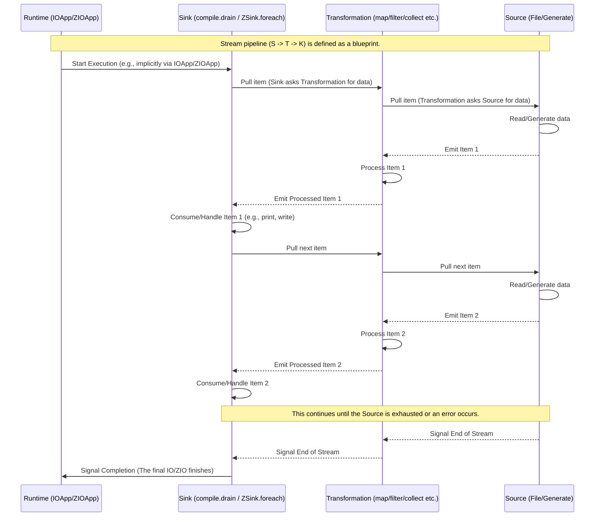

# Chapter 5: Stream Sinks and Running

Welcome back! In the previous chapters, we've built up our understanding of streams:
*   In [Chapter 1: Stream](01_stream_.md), we learned that a `Stream` is a blueprint, like a conveyor belt design. It describes a flow of data but doesn't *do* anything on its own.
*   In [Chapter 2: Effects (IO/ZIO)](02_effects__io_zio__.md), we saw how `IO` and `ZIO` represent actions that interact with the real world (side effects), and how streams use these for operations like printing or reading files.
*   In [Chapter 3: File I/O](03_file_i_o_.md), we connected the start of our conveyor belt to a real data source: files.
*   In [Chapter 4: Stream Transformations](04_stream_transformations_.md), we added "stations" to the belt to process, filter, and change the items flowing through.

So now we have a complete design for a data pipeline: data comes from a source (like a file), flows through transformations, and ends up... where?

This is the missing piece! A stream definition describes the pipeline, but it doesn't execute it. To actually make the data flow and the operations happen, you need to **run** or **compile** the stream. And when you run it, you usually need something at the very end of the belt to receive and handle the processed items. This something is called a **Sink**.

### What Problem Do Sinks and Running Solve?

Imagine you've designed the perfect assembly line (your stream pipeline). You have raw materials entering one end (your source), stations that transform the materials (your transformations), but unless you turn on the power (run the stream) and have someone or something at the end to collect, package, or use the finished products (your sink), nothing will ever actually happen.

The stream definition is passive. Running the stream is the active step that makes the computation happen, potentially performing side effects and consuming the data.

### Running the Stream: Turning on the Belt

The act of executing a stream definition is often called **running** (in ZIO Streams) or **compiling** (in FS2). This process takes your stream blueprint and turns it into an effectful action (`IO` in FS2, `ZIO` in ZIO Streams) that, when executed by the runtime, actually performs the stream's operations.

#### Running for Side Effects (`compile.drain` / `runDrain`)

Sometimes, the entire purpose of your stream is to perform side effects for each element, like printing to the console, writing to a file, or sending data over a network, and you don't need to collect any final result from the stream itself.

In this case, you run the stream purely for its effects.

*   **FS2:** You use `.compile.drain`.
*   **ZIO Streams:** You use `.runDrain`.

Let's look at a simple example (similar to what's inside `evalMap` or `mapZIO` followed by a drain):

```scala
import fs2.Stream
import cats.effect.IO
import cats.effect.unsafe.implicits.global // Required for unsafeRunSync outside IOApp

val printStream: Stream[IO, Int] =
  Stream(1, 2, 3).evalMap(i => IO(println(s"Processing $i")))
  // This stream emits Ints, but the effectful part is printing inside evalMap

// Define the action to run the stream for its effects
val runPrintStream: IO[Unit] = printStream.compile.drain

// Now, execute the action (usually done by IOApp.run)
// runPrintStream.unsafeRunSync()

// Expected console output when run:
// Processing 1
// Processing 2
// Processing 3
```

In this FS2 example:
1.  `Stream(1, 2, 3)` creates a stream emitting 1, 2, and 3.
2.  `.evalMap(i => IO(println(s"Processing $i")))` adds a transformation that, for each number, creates an `IO` action to print a message. The stream still conceptually emits the numbers, but the *effect* is defined here.
3.  `.compile.drain` takes this `Stream[IO, Int]` blueprint and produces an `IO[Unit]`. This `IO` action represents running the entire stream pipeline, executing the `println` effects for each element, and discarding the `Int` elements themselves.

The ZIO Streams equivalent:

```scala
import zio.*
import zio.stream.*

val printStream: ZStream[Any, Throwable, Int] =
  ZStream(1, 2, 3).mapZIO(i => Console.printLine(s"Processing $i"))
  // This stream emits Ints, but the effectful part is printing inside mapZIO

// Define the action to run the stream for its effects
val runPrintStream: Task[Unit] = printStream.runDrain

// Now, execute the action (usually done by ZIOApp.run)
// zio.Runtime.default.unsafe.run(runPrintStream) // Don't do this in production!

// Expected console output when run:
// Processing 1
// Processing 2
// Processing 3
```

Here:
1.  `ZStream(1, 2, 3)` creates the stream.
2.  `.mapZIO(i => Console.printLine(s"Processing $i"))` adds the effectful printing step using `mapZIO`.
3.  `.runDrain` takes this `ZStream` blueprint and produces a `Task[Unit]` (a type of `ZIO`). This `ZIO` action runs the stream, performs the printing effects, and discards the emitted data.

In both cases, `drain` tells the library that you only care about the side effects defined *within* the stream pipeline (like those in `evalMap` or `mapZIO`), not the data elements that reach the end.

You see `.compile.drain` used in `Converter1.scala`, `WindowedAverage.scala`, `EchoServer.scala`, and `.runDrain` in `zioVersion/QueueExample.scala` because the final step is writing to the console or handling network effects – no data needs to be collected by the caller.

#### Running to Collect Data (`compile.toList` / `runCollect`)

Sometimes, you might want to run the entire stream and collect *all* the emitted data elements into a standard Scala collection like a `List` or `Chunk`.

*   **FS2:** You use `.compile.toList`.
*   **ZIO Streams:** You use `.runCollect`.

```scala
import fs2.Stream
import cats.effect.IO
import cats.effect.unsafe.implicits.global // Required for unsafeRunSync outside IOApp

val numberStream: Stream[IO, Int] = Stream(1, 2, 3, 4)

// Define the action to run the stream and collect results
val collectNumbers: IO[List[Int]] = numberStream.compile.toList

// Execute the action
// val resultList: List[Int] = collectNumbers.unsafeRunSync()
// println(resultList)

// Expected console output when run:
// List(1, 2, 3, 4)
```

ZIO Streams equivalent:

```scala
import zio.*
import zio.stream.*
import zio.Chunk // ZIO often uses Chunk for collections

val numberStream: ZStream[Any, Throwable, Int] = ZStream(1, 2, 3, 4)

// Define the action to run the stream and collect results
val collectNumbers: Task[Chunk[Int]] = numberStream.runCollect

// Execute the action
// val resultChunk: Chunk[Int] = zio.Runtime.default.unsafe.run(collectNumbers)
// println(resultChunk)

// Expected console output when run:
// Chunk(1, 2, 3, 4)
```

**IMPORTANT NOTE:** While these methods are simple to use, they are generally **not recommended for large or infinite streams**. They defeat the memory-efficiency benefit of streaming by attempting to hold *all* stream elements in memory at once. Use `compile.toList` or `runCollect` only when you are certain the stream will be small.

### Sinks: The End of the Conveyor Belt

When you don't just want to `drain` effects or collect everything into memory, you need a **Sink**. A Sink is a component that consumes data from the end of the stream.

*   **FS2:** Sinks are often represented as `Pipe[F, I, Unit]`. A pipe that takes items of type `I` and doesn't produce any elements (`Unit`) is essentially a sink that performs effects with the incoming data. FS2 also has a `Sink` type, but pipes are commonly used this way. You apply such a pipe using `through` and then `compile.drain`.
*   **ZIO Streams:** Sinks are explicitly represented by the `ZSink[R, E_in, In, L, Out]` type. You run a stream with a sink using the `.run(sink)` method.

Let's look at examples from the code:

#### FS2 Sink Example (`stdout[IO]()`)

In FS2, writing to standard output is provided as a `Pipe[IO, Byte, Unit]`. This pipe acts as a sink for streams of bytes. You apply it with `through`, and then use `compile.drain` to run the whole pipeline.

Look at the end of the `Converter1.scala` FS2 code:

```scala
// Snippet from src/main/scala/Converter1.scala (FS2)
// ... stream of String values representing Celsius temperatures ...
.intersperse("\n")                 // Stream[IO, String] - Add newlines
.through(text.utf8.encode)         // Stream[IO, Byte] - Encode String to Byte
.through(stdout[IO]())             // Stream[IO, Unit] - This pipe writes Bytes to stdout (acting as a sink)

// This whole pipeline is assigned to 'converter', which is a Stream[IO, Unit]
val converter: Stream[IO, Unit] = ???

// In the run method, we compile and drain this Stream[IO, Unit]
def run: IO[Unit] =
  converter.compile.drain // Runs the pipeline, executing the stdout writes
```

Here:
1.  The stream is transformed into a `Stream[IO, Byte]`.
2.  `.through(stdout[IO]())` applies the `stdout` pipe. This pipe consumes the `Byte` elements and writes them to standard output as a side effect. The output stream of this pipe is `Stream[IO, Unit]`, indicating that its primary action is effectful and it doesn't emit meaningful data elements.
3.  `converter` holds the blueprint for this entire pipeline.
4.  `converter.compile.drain` creates the final `IO[Unit]` action. When executed by the `IOApp` runtime, this action drives the stream from the source, through all transformations, to the `stdout` pipe, which performs the printing side effects. `drain` confirms that we only care about these effects, not any data the `stdout` pipe might theoretically emit (which is `Unit`).

#### ZIO Streams Sink Example (`ZSink.foreach`)

In ZIO Streams, you explicitly use `ZSink`. A common and flexible sink is `ZSink.foreach`. It takes a function that performs an effect for each incoming element, much like `evalMap`/`mapZIO` but at the very end of the stream run.

Look at the end of the `zioVersion/Converter1.scala` ZIO Streams code:

```scala
// Snippet from src/main/scala/zioVersion/Converter1.scala (ZIO Streams)
// ... converter is a ZStream[Any, Throwable, Either[String, String]] ...
val converter: ZStream[Any, Throwable, Either[String, String]] = ???

def run =
  for output <- converter.run(ZSink.foreach { // Run the converter stream using this sink
      case Left(error) => Console.printLineError(error) // If Left (error message), print to stderr
      case Right(line) => Console.printLine(line)      // If Right (Celsius string), print to stdout
    })
  yield output // ZIOAppDefault executes this ZIO action
```

Here:
1.  `converter` is a `ZStream` emitting `Either[String, String]` values (either an error message or a valid Celsius string).
2.  `.run(ZSink.foreach { ... })` takes this `ZStream` and runs it using the provided `ZSink`.
3.  `ZSink.foreach` is a sink that applies the given function (`{ case Left(...) => ... case Right(...) => ... }`) to *each* element it receives from the stream. The function performs a side effect (`Console.printLine` or `Console.printLineError`).
4.  `.run(...)` produces a `ZIO` value. When executed by `ZIOAppDefault`, this `ZIO` value drives the stream and runs the sink for each element. The `for/yield` syntax is part of building the final `ZIO` value that the app runs.

`ZSink.foreach` is very versatile for element-by-element processing with effects at the end. Other ZIO Sinks exist for collecting data (`ZSink.collectAll`), writing to files, etc.

### The `run` Method: The Starting Point of Execution

In both FS2 (with Cats Effect's `IOApp`) and ZIO Streams (`ZIOAppDefault`), the special `run` method is where you define the main effectful action (`IO[Unit]` or `ZIO[R, E, Unit]`) that represents your entire application.

This `run` method is where you typically place the final `.compile.drain` or `.run(sink)` call for your main stream pipeline.

```scala
// From src/main/scala/Converter1.scala (FS2)
object Converter1 extends IOApp.Simple:
  // ... converter stream definition ...
  def run: IO[Unit] =
    converter.compile.drain // This is the IO action executed by IOApp
```

```scala
// From src/main/scala/zioVersion/Converter1.scala (ZIO Streams)
object Converter1 extends ZIOAppDefault:
  // ... converter stream definition ...
  def run = // ZIOAppDefault executes this ZIO action
    for output <- converter.run(ZSink.foreach { ... })
    yield output
```

The runtime (provided by `IOApp.Simple` or `ZIOAppDefault`) is responsible for executing the `IO` or `ZIO` value that your `run` method returns. This execution is what actually turns on the stream and makes the data flow from source to sink.

### How Running and Sinks Work Under the Hood (Simplified Pull)

Let's expand our pull-based diagram from [Chapter 4: Stream Transformations](04_stream_transformations_.md) to include the final run step and the Sink.



Key points:
*   The Runtime initiates the process by executing the final effect (`IO`/`ZIO`) produced by `compile` or `run`.
*   The Sink (`K`) is the component that drives the stream by initiating the "pull" for data. It's actively asking for the next item.
*   This pull request propagates upstream through all the transformations (`T`) back to the source (`S`).
*   The Source (`S`) is the component that *emits* data, but only when asked by downstream.
*   Data then flows back downstream from Source to Transformation, from Transformation to Sink, item by item.
*   The Sink consumes the item, performs its action (like printing), and then pulls for the next item.
*   When the Source runs out of data, it signals the end of the stream, which propagates downstream, causing the stream execution to finish, and the final `IO`/`ZIO` action to complete.

### Summary of Running Streams

Here's a quick comparison of common ways to run streams:

| Method              | Purpose                                   | What it produces        | Memory Usage | Typical Use Case                             | Libraries |
| :------------------ | :---------------------------------------- | :---------------------- | :----------- | :------------------------------------------- | :-------- |
| `compile.drain`     | Run only for side effects, discard data   | `IO[Unit]`              | Low          | Printing, writing files, network I/O (via Pipes) | FS2       |
| `runDrain`          | Run only for side effects, discard data   | `ZIO[R, E, Unit]`       | Low          | Printing, writing files, network I/O (via mapZIO/foread) | ZIO Streams |
| `compile.toList`    | Run and collect all data into a `List`    | `IO[List[O]]`           | High         | Small streams, testing                         | FS2       |
| `runCollect`        | Run and collect all data into a `Chunk`   | `ZIO[R, E, Chunk[O]]`   | High         | Small streams, testing                         | ZIO Streams |
| `compile.to(sink)`  | Run data through a specific FS2 `Sink`    | `IO[Output]`            | Low          | Custom complex sinks                           | FS2       |
| `run(sink)`         | Run data through a specific ZIO `ZSink`   | `ZIO[R, E, Output]`     | Low          | Writing, collecting, processing data with sinks | ZIO Streams |

(`O` is the type of elements emitted by the stream before the final run/compile step).

### Sinks and Running in the Examples

*   `Converter1.scala` (FS2): Defines a `Stream[IO, Unit]` pipeline (`converter`) that ends with a `through(stdout[IO]())` sink pipe. The `run` method then calls `converter.compile.drain` to execute it.
*   `WindowedAverage.scala` (FS2): Similar to `Converter1`, defines a `Stream[IO, Unit]` pipeline ending with `through(stdout[IO]())`. The `run` method calls `averager.compile.drain`.
*   `EchoServer.scala` (FS2): The main server stream is built, and the `run` method uses `.compile.drain` to execute it. The stream itself involves writing to sockets (`through(clientSocket.writes)`), which acts as a sink for that part of the pipeline.
*   `QueueExample.scala` (FS2): The merged producer/consumer stream is built. The `run` method uses `.compile.drain` to execute it. The effects (queue offer/take, ref update, printing) happen inside `evalMap`.
*   `zioVersion/Converter1.scala` (ZIO Streams): Defines a `ZStream[..., Either[String, String]]`. The `run` method uses `.run(ZSink.foreach { ... })` to consume the stream, printing elements using `Console.printLine` within the sink's foreach function.
*   `zioVersion/QueueExample.scala` (ZIO Streams): The merged producer/consumer stream is built, and the `run` method uses `.runDrain` to execute it. Effects (queue offer/take, ref update, printing) happen inside `mapZIO`.

In all these examples, the final step in the `run` method is the call that kicks off the stream processing from source to sink.

### Conclusion

Defining a stream pipeline is like drawing a map or designing a machine. To make the journey happen or the machine run, you need to actively **run** or **compile** the stream. This process turns the passive blueprint into an active effect.

**Sinks** are the crucial end points of stream execution. They are components designed to consume and process the data emitted by the stream, often performing side effects like writing to files or the console. Methods like `compile.drain`/`runDrain` are used when the effects happen *within* the stream pipeline, while `compile.to(sink)`/`run(sink)` are used with explicit sink components.

Understanding how to run a stream and the role of sinks completes the picture of building a basic stream-processing application. You now know how to get data, process it incrementally, and make it *do* something.

But what happens when things go wrong? File not found, parsing errors, network issues? That's where **Error Handling** comes in, the topic of our next chapter.

[Error Handling](06_error_handling_.md)

---

<sub><sup>**References**: [[1]](https://github.com/fancellu/fs2-examples/blob/d19af876ffe7973e915074614767f092f9680874/src/main/scala/Converter1.scala), [[2]](https://github.com/fancellu/fs2-examples/blob/d19af876ffe7973e915074614767f092f9680874/src/main/scala/EchoServer.scala), [[3]](https://github.com/fancellu/fs2-examples/blob/d19af876ffe7973e915074614767f092f9680874/src/main/scala/QueueExample.scala), [[4]](https://github.com/fancellu/fs2-examples/blob/d19af876ffe7973e915074614767f092f9680874/src/main/scala/WindowedAverage.scala), [[5]](https://github.com/fancellu/fs2-examples/blob/d19af876ffe7973e915074614767f092f9680874/src/main/scala/zioVersion/Converter1.scala), [[6]](https://github.com/fancellu/fs2-examples/blob/d19af876ffe7973e915074614767f092f9680874/src/main/scala/zioVersion/QueueExample.scala), [[7]](https://github.com/fancellu/fs2-examples/blob/d19af876ffe7973e915074614767f092f9680874/src/main/scala/zioVersion/WindowedAverage.scala)</sup></sub>