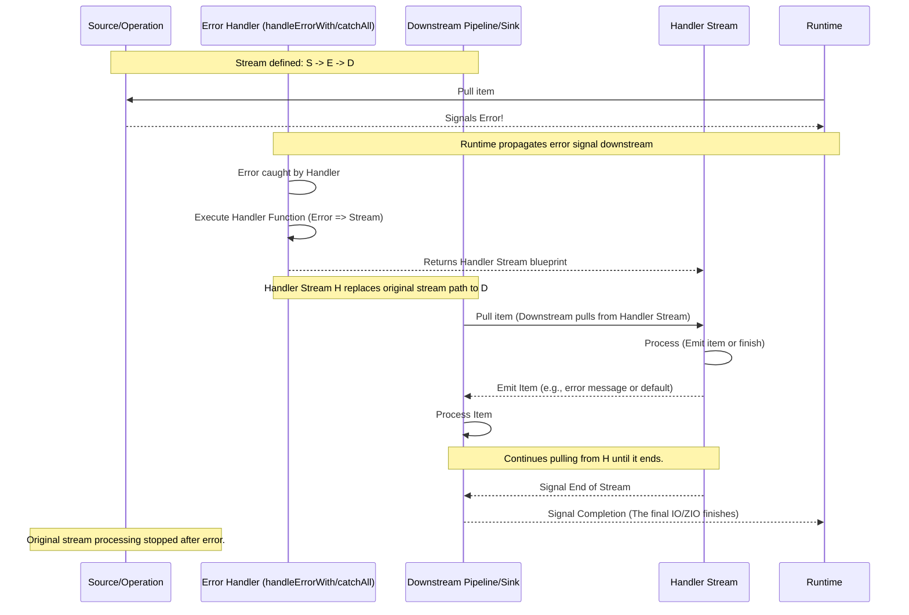

# Chapter 6: Error Handling

Welcome back! In our journey through `fs2-examples`, we've learned what a [Stream](01_stream_.md) is, how [Effects (IO/ZIO)](02_effects__io_zio__.md) let us interact with the real world, how to read data from [File I/O](03_file_i_o_.md), how to apply [Stream Transformations](04_stream_transformations_.md) to process data, and finally, how [Stream Sinks and Running](05_stream_sinks_and_running_.md) make the whole pipeline execute.

But what happens when things go wrong? What if the file we try to read doesn't exist? What if a network connection drops mid-stream? What if the data we expect is malformed and causes a parsing error?

Leaving these issues unhandled can lead to your entire program crashing unexpectedly. This is where **Error Handling** in streams comes in. It allows you to anticipate problems and define how your stream should react gracefully, preventing a complete failure.

### What Problem Does Error Handling Solve?

Imagine our conveyor belt pipeline again. Data is flowing nicely from the source, through various transformations, and into the sink. Suddenly, the source encounters a problem (like a file disappearing), or a transformation fails (like trying to parse text that isn't a valid number).

Without error handling, this is like the conveyor belt suddenly stopping or an item exploding on the belt, halting everything that comes after it. The entire process grinds to a halt, and your application might terminate abruptly.

We want our pipeline to be more resilient. When an error occurs, we'd prefer to:

1.  Log the error but keep processing (if possible).
2.  Substitute the problematic item with a default value.
3.  Skip the rest of the current source and move on to the next one.
4.  Switch to a "fallback" stream that provides default or error-indicating data.
5.  Perform necessary cleanup before stopping in a controlled manner.

Stream libraries provide tools to catch these errors *within* the stream definition itself, allowing you to implement these strategies.

### Handling Errors within the Stream Pipeline

Both FS2 and ZIO Streams offer specific operators to catch errors that occur upstream in the pipeline. When an effect within the stream (like reading a file line) or a transformation's function (like parsing) signals an error instead of emitting an item, these operators intercept that error signal.

The primary operators are:

*   **FS2:** `handleErrorWith`
*   **ZIO Streams:** `catchAll` (and variations like `catchSome`, `orElse`)

These operators are placed in the stream pipeline like any other transformation. When an error occurs upstream of the operator, the operator catches it and then uses a function you provide to decide what to do next. Crucially, this function typically returns a *new stream* that replaces the rest of the original stream from that point onward.

Let's look at how this works conceptually.

### FS2: `handleErrorWith`

The `handleErrorWith` operator in FS2 takes a function `Throwable => Stream[F, O]`. If any effect or operation upstream of `handleErrorWith` fails with a `Throwable`, that `Throwable` is passed to your function. Your function then returns a new `Stream` (`Stream[F, O]`) that continues the pipeline from that point.

Analogy: A sensor on the conveyor belt detects a problem (the error). It immediately diverts the belt's path, and from that point on, items flow onto a *different* conveyor belt you've designed specifically for error scenarios.

Consider this simple example:

```scala
import fs2.Stream
import cats.effect.IO

// A stream that emits 1, then 2, then fails with an error, then planned to emit 3
val errorStream: Stream[IO, Int] =
  Stream(1, 2) ++ Stream.raiseError[IO](new RuntimeException("Something went wrong!")) ++ Stream(3)

// Use handleErrorWith to catch the error and provide a fallback stream
val handledStream: Stream[IO, Int] = errorStream.handleErrorWith { error =>
  // This function is called when the error occurs
  println(s"Caught error: ${error.getMessage}")
  // Return a new stream that replaces the rest of the original stream
  Stream(-1, -2) // Emit -1 and -2 instead
}

// If you run handledStream and collect to list (for demo):
// handledStream.compile.toList.unsafeRunSync() // Result: List(1, 2, -1, -2)
```

In this example:
1.  The original `errorStream` emits `1` and `2`.
2.  It then encounters `Stream.raiseError`, which signals an error.
3.  The `handleErrorWith` operator catches this error.
4.  The provided function (`{ error => ... }`) executes, printing the error message.
5.  The function returns `Stream(-1, -2)`.
6.  From this point on, the stream pipeline *stops processing the rest of the original stream* (`++ Stream(3)` is skipped) and instead continues with the fallback stream `Stream(-1, -2)`, emitting `-1` and `-2`.

The `handleErrorWith` operator is used in `Converter1.scala` and `WindowedAverage.scala` to handle potential file reading errors:

```scala
// Snippet from src/main/scala/Converter1.scala (FS2)
val inout: List[Stream[IO, String]] = files.map { file =>
  Files[IO]
    .readUtf8Lines(file) // This might fail if 'file' doesn't exist
    .handleErrorWith(handleError) // Catch the error here
    // ... rest of pipeline (.collect, etc.) ...
}

// Definition of handleError in Converter1.scala:
def handleError(error: Throwable): Stream[IO, Unit] =
  Stream // Create a stream that emits an error message
    .emit(s"\nError: ${error.getMessage}")
    .through(text.utf8.encode)
    .through(stderr[IO]()) // And writes it to standard error

```

Here, `handleErrorWith(handleError)` is placed right after the file reading source (`Files[IO].readUtf8Lines`). If `readUtf8Lines` fails (e.g., for "testdata/filenotfound.txt"), the `handleErrorWith` catches the `IOException`, calls the `handleError` function, which produces a stream that emits an error message string and writes it to standard error. The rest of the processing (`.collect` etc.) for *that specific file's stream* is skipped.

### ZIO Streams: `catchAll`

The `catchAll` operator in ZIO Streams is similar to `handleErrorWith`. It takes a function `E => ZStream[R2, E2, O2]`, where `E` is the error type of the upstream stream. If an error of type `E` occurs, the function receives the error value and returns a new `ZStream` that continues the pipeline.

Analogy: Same as FS2 – detecting the error on the belt causes a switch to a recovery belt defined by your error handling function.

ZIO Streams often uses `Either` to represent success (`Right`) or failure (`Left`) *at the value level* within the stream, allowing you to handle errors as data. `catchAll` can be used to turn an error signal (`ZStream.fail` or an effect failure) into emitting a success value (e.g., `Right(...)` or `Left(...)`) or to replace the stream with a different one.

Let's see the ZIO Streams equivalent in `Converter1.scala`:

```scala
// Snippet from zioVersion/Converter1.scala (ZIO Streams)
def processFile(file: Path): UStream[Either[String, String]] =
  Files
    .lines(file) // This ZStream might fail with Throwable
    .collect { case Fahrenheit(double) =>
      Right(f"${f2c(double)}%.2f") // Successful parse -> Right value
    }
    .catchAll(error => // Catch any Throwable failure from upstream
      ZStream.succeed( // Return a new stream that succeeds by emitting...
        Left(s"Error: ${error.getMessage})") // ...a Left value containing the error message
      )
    )

// The overall stream emitted by processFile is UStream[Either[String, String]]
// It never fails with Throwable, but emits Either values indicating success or failure for each line/file.
```

In this ZIO example:
1.  `Files.lines(file)` produces a `ZStream[Throwable, String]`.
2.  `.collect { ... }` processes lines, and if parsing succeeds, it emits `Right(celsius)`. If parsing fails, the line is *dropped* by `collect`.
3.  If `Files.lines` itself fails (e.g., file not found), the `catchAll` operator intercepts the `Throwable` error.
4.  The `catchAll` function `{ error => ... }` is called. It returns `ZStream.succeed(Left(s"Error: ..."))`.
5.  This new stream emits a single `Left` value containing the error message.
6.  The original stream's failure is turned into a success by emitting a value that signals an error (the `Left`). The stream now emits `Either[String, String]` values.

This pattern of using `catchAll` to emit an `Either` value is common in ZIO Streams when you want to continue the stream but signal that a specific part failed.

Another example in `zioVersion/WindowedAverage.scala` shows `catchAll` being used to emit an error message *and then re-fail*:

```scala
// Snippet from zioVersion/WindowedAverage.scala (ZIO Streams)
.catchAll(error => handleError(error) *> ZStream.fail(error))
```

Here, if an error occurs (specifically, likely from `Files.lines`), it:
1.  Calls `handleError(error)` which returns `ZStream.succeed(s"\nError: ${error.getMessage}")` (emits an error message string).
2.  Uses `*>` to sequence this stream with `ZStream.fail(error)`.
3.  The resulting stream first emits the error message string (which is handled by the Sink later), and *then* fails with the original error, potentially stopping the overall stream run unless a further `catchAll` or error handling mechanism exists downstream. This allows logging the error message *before* the stream terminates due to the failure.

### Error Handling Strategies in Streams

The examples illustrate key strategies:

1.  **Replace the rest of the stream:** Both `handleErrorWith` and `catchAll` allow you to switch to a new stream. This new stream could emit default values, a single error message (like in FS2's `handleError`), or be an empty stream (`Stream.empty` or `ZStream.empty`) to simply stop processing that branch gracefully.
2.  **Emit error information as data:** ZIO Streams, especially when using `Either` as the stream's output type, allows you to use `catchAll` to catch a *failure signal* and turn it into a *success value* (a `Left(...)`) that flows downstream. This lets subsequent transformations process the error information as regular data.
3.  **Handle specific errors:** Both libraries offer ways to handle only specific types of errors (e.g., FS2's `handleErrorWith { case MyError(_) => ... }` or ZIO's `catchSome`). `EchoServer.scala` demonstrates this by catching `ExitException` or `KillServerException` differently:

```scala
// Snippet from src/main/scala/EchoServer.scala (FS2)
.handleErrorWith {
  case KillServerException => Stream.raiseError(KillServerException) // Propagate this specific error
  case ExitException => // Handle ExitException gracefully
    Stream.eval(Console[F].println("Ending connection")) ++
    Stream.emit("Byebye!\n\r").through(encodeAndWrite(clientSocket)) ++
    Stream.empty // End this client stream gracefully
}
```

This allows the server to shut down on `KillServerException` (which is caught further up) but cleanly close a single client connection on `ExitException`.

### How Error Handling Works Under the Hood (Simplified)

When an error occurs in a stream effect (like a file read throwing an exception) or within a transformation that reports failure, an "error signal" travels downstream instead of a data item.

The `handleErrorWith` or `catchAll` operator is designed to intercept this specific signal. Instead of propagating the error downstream (which would typically stop the stream run unless another handler is met), it activates the error handling function you provided. This function is expected to return a *new stream* blueprint. The operator then effectively swaps the rest of the original stream's execution plan with the execution plan of the new stream returned by your handler.



This diagram illustrates that once the error handler catches the error, the original upstream stream stops, and the downstream pipeline receives data (or an end-of-stream signal) from the *handler stream* instead.

### Error Handling Summary

| Feature              | FS2 `handleErrorWith`                     | ZIO Streams `catchAll`                   |
| :------------------- | :---------------------------------------- | :--------------------------------------- |
| **Purpose**          | Catch upstream `Throwable`, replace stream | Catch upstream `E`, replace stream       |
| **Handler Signature**| `Throwable => Stream[F, O]`               | `E => ZStream[R2, E2, O2]`               |
| **Replacement**      | Replaces remaining stream with handler stream | Replaces remaining stream with handler stream |
| **Common Strategy**  | Emit error message via `Stream.emit`, switch to `Stream.empty` | Emit error value (`Left`) via `ZStream.succeed`, switch to empty or re-fail |
| **Error Type**       | Usually `Throwable`                       | Defined by `ZStream` type parameter `E` |

Both provide powerful ways to make your stream pipelines resilient to failures. The choice between emitting error messages as data (`Left` in ZIO) versus using the error handler purely for side effects or switching to an empty stream depends on whether downstream steps need to be aware of or process the error condition.

### Error Handling in the Examples

You can see error handling applied in the example code:

*   `Converter1.scala` / `WindowedAverage.scala` (FS2): Use `.handleErrorWith` right after `Files[IO].readUtf8Lines` to catch file-not-found errors and print an error message using a small error stream (`handleError`).
*   `EchoServer.scala` (FS2): Uses `.handleErrorWith` on the client connection stream to catch custom exceptions (`ExitException`, `KillServerException`) and react differently to each, demonstrating conditional error handling and clean connection shutdown.
*   `zioVersion/Converter1.scala` (ZIO Streams): Uses `.catchAll` after parsing. This catches potential `Throwable` errors from file reading and transforms them into a stream that emits a single `Left` value containing the error message. The stream's type becomes `UStream[Either[String, String]]`.
*   `zioVersion/WindowedAverage.scala` (ZIO Streams): Uses `.catchAll` after parsing/collect. It uses `handleError` to emit an error message *and then* uses `ZStream.fail` to re-signal the original error, potentially terminating the stream run while ensuring the error message is emitted first.

These examples showcase different strategies for handling errors gracefully within the stream, preventing crashes and allowing for controlled reactions to problems.

### Conclusion

Errors are an inevitable part of real-world applications. By understanding and applying error handling techniques like FS2's `handleErrorWith` and ZIO Streams' `catchAll`, you can build stream pipelines that are robust and resilient. These operators allow you to define how your stream should react when problems occur, such as logging messages, providing fallback data, or switching to alternative processing paths, rather than simply crashing.

With error handling in place, our stream pipelines can handle unexpected issues. But what about expected complexity, like needing to perform multiple operations concurrently or communicate between different parts of our application running at the same time? That brings us to our next topic: [Concurrency](07_concurrency_.md).

[Concurrency](07_concurrency_.md)

---

<sub><sup>**References**: [[1]](https://github.com/fancellu/fs2-examples/blob/d19af876ffe7973e915074614767f092f9680874/src/main/scala/Converter1.scala), [[2]](https://github.com/fancellu/fs2-examples/blob/d19af876ffe7973e915074614767f092f9680874/src/main/scala/EchoServer.scala), [[3]](https://github.com/fancellu/fs2-examples/blob/d19af876ffe7973e915074614767f092f9680874/src/main/scala/WindowedAverage.scala), [[4]](https://github.com/fancellu/fs2-examples/blob/d19af876ffe7973e915074614767f092f9680874/src/main/scala/zioVersion/Converter1.scala), [[5]](https://github.com/fancellu/fs2-examples/blob/d19af876ffe7973e915074614767f092f9680874/src/main/scala/zioVersion/WindowedAverage.scala)</sup></sub>