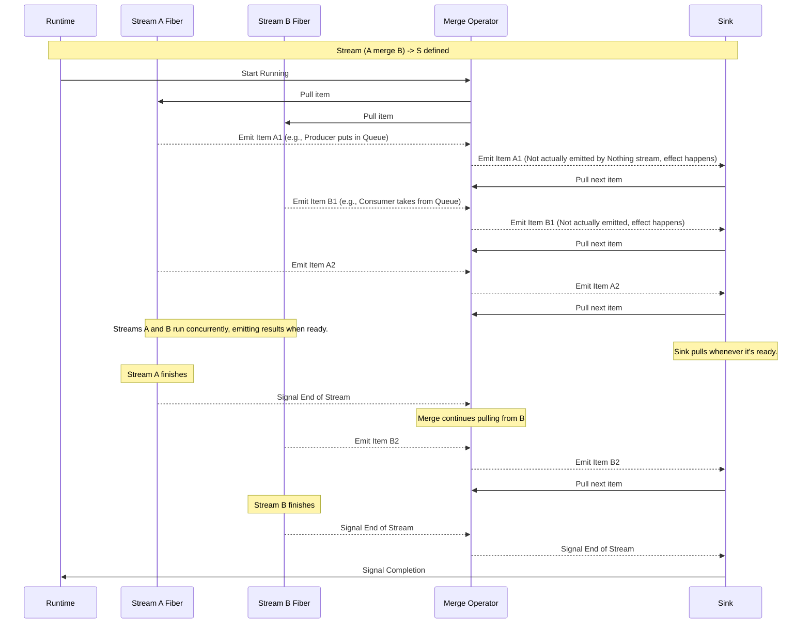
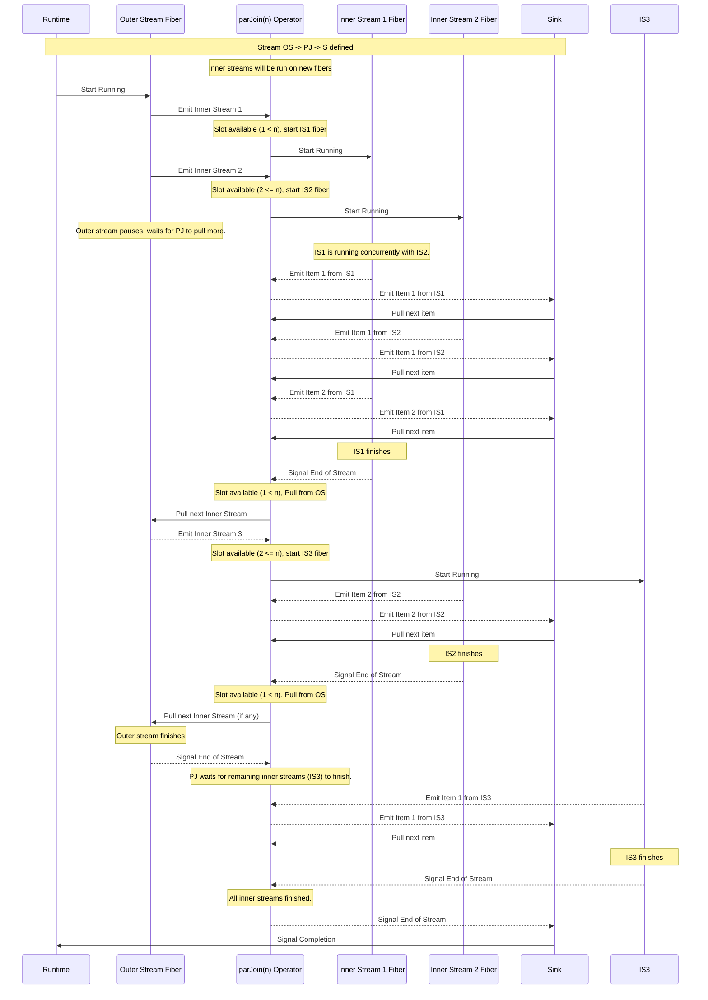
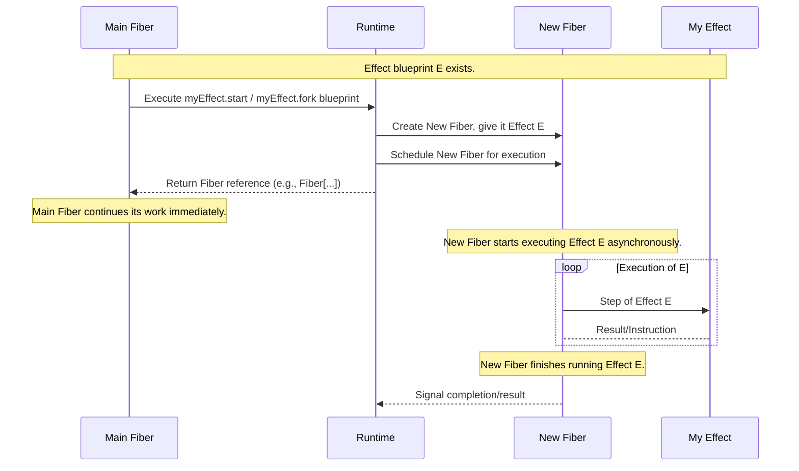

# Chapter 7: Concurrency

Welcome back! In the last chapter, [Error Handling](06_error_handling_.md), we learned how to make our stream pipelines resilient to unexpected problems. We now know how to get data into a [Stream](01_stream_.md) ([File I/O](03_file_i_o_.md)), process it with [Stream Transformations](04_stream_transformations_.md) using [Effects (IO/ZIO)](02_effects__io_zio__.md), finish the process with [Stream Sinks and Running](05_stream_sinks_and_running_.md), and handle [Error Handling](06_error_handling_.md).

So far, our streams have mostly processed data sequentially. One item comes in, gets processed, and then the next item comes in. This works great for many tasks, like reading and converting a single file.

But what if your application needs to do multiple things *at the same time*? What if you have a server that needs to handle many client connections concurrently? What if you have a 'producer' stream generating data and a 'consumer' stream processing it, and you want them running simultaneously? What if you need to run a background task (like monitoring user input) while your main process is running?

If these tasks involve waiting (like waiting for data from a network connection, waiting for a file to be read, or just waiting for a timed delay), doing them purely sequentially means one task blocks the others. This can make your application slow and unresponsive.

This is where **Concurrency** comes in.

### What Problem Does Concurrency Solve?

Concurrency is about structuring your program so that it can work on multiple tasks seemingly at the same time. This doesn't necessarily mean they are all running on separate CPU cores (that's parallelism, a related but distinct concept), but rather that the program can make progress on one task while waiting for another task to complete something slow like I/O.

Think back to our conveyor belt analogy. Up until now, we've mostly considered a single, perhaps complex, conveyor belt. Concurrency allows us to manage **multiple conveyor belts running in parallel**.

*   You might have data coming from two different sources that you want to process and combine onto a single belt.
*   You might have a situation where *each* item arriving represents the *start of a new conveyor belt* that needs processing (like a new client connection arriving at a server). You want to process many of these incoming belts concurrently, up to a certain limit.
*   You might have a small side task that needs its own dedicated mini-belt running in the background, independent of your main processing belt.

Stream libraries like FS2 and ZIO Streams, built on top of effect libraries like Cats Effect and ZIO, provide powerful and safe ways to manage concurrency. They use lightweight concurrent units called **fibers** (Cats Effect/FS2) or **ZIO fibers** (ZIO) instead of traditional operating system threads, making it efficient to manage thousands or millions of concurrent tasks.

Let's look at some key operations and concepts for achieving concurrency with streams and effects.

### Combining Streams: `merge`

The simplest way to introduce concurrency to streams is often by combining the output of two (or more) independent streams onto a single output stream. The `merge` operation does this. It runs both source streams concurrently and emits items from whichever stream has data ready.

Analogy: You have two separate conveyor belts bringing items. You use a special junction to combine them onto a single main belt. Items from both original belts appear on the main belt in the order they arrive at the junction.

Consider the `QueueExample.scala` and `zioVersion/QueueExample.scala` examples. They have a `producer` stream and a `consumer` stream. The `producer` puts numbers into a queue, and the `consumer` takes numbers *from* the queue. For this to work, both streams must run at the same time.

```scala
// Snippet from src/main/scala/QueueExample.scala (FS2)
// producer(queue) is a Stream[IO, Nothing] (it performs effects but emits no data)
// consumer(queue, ref) is a Stream[IO, Nothing] (same)

// merge producer and consumer streams
mergedStream <- producer(queue).merge(consumer(queue, ref))
```

```scala
// Snippet from src/main/scala/zioVersion/QueueExample.scala (ZIO Streams)
// producer(queue) is a UStream[Nothing]
// consumer(queue, ref) is a UStream[Nothing]

// merge producer and consumer streams
_ <- (producer(queue) merge consumer(queue, ref)) // Using parentheses due to operator precedence
  .interruptAfter(1.second) // Run for 1 second, then stop
  .runDrain // Run for effects, discard output
```

In both examples, `producer(...) merge consumer(...)` creates a *single* stream blueprint. When this merged stream is executed (`runDrain`), the runtime starts both the `producer` stream and the `consumer` stream concurrently. The `producer` starts emitting numbers (as effects into the queue), and the `consumer` starts pulling from the queue, processing numbers as they become available.

The type `Stream[IO, Nothing]` or `UStream[Nothing]` indicates that these streams are run purely for their *effects* (like `println` and queue operations), not for the data they emit (there isn't any). `merge` can also be used with streams that *do* emit data, combining the emitted elements onto the single output stream.

**How `merge` Works Under the Hood (Simplified):**

When a merged stream `A.merge(B)` is run, the runtime effectively starts running stream `A` and stream `B` on separate fibers. The `merge` operator then acts as a funnel, pulling results from whichever fiber has data ready and emitting it downstream. If one stream finishes, `merge` continues pulling only from the other until it also finishes.



This shows `merge` allowing `A` and `B` to make progress independently, and the sink receiving items from either as they become available. For streams like the ones in `QueueExample` that emit `Nothing`, the "emission" is just the completion of the effectful step (`queue.offer` or `ref.update`), and `merge` coordinates these effect completions.

### Processing Multiple Inner Streams: `parJoin` (FS2) / `flatMapPar` (ZIO Streams)

A common pattern, especially in network programming, is having a stream where each element *is itself a stream*. For example, a server's `accept` method might emit a new stream of bytes for *each incoming connection*. You want to process many of these connection streams concurrently.

*   **FS2:** Use the `parJoin(n)` operation. It takes a stream of streams (`Stream[F, Stream[F, O]]`) and runs up to `n` of the inner streams concurrently, merging all their emitted items (`O`) onto a single output stream (`Stream[F, O]`).
*   **ZIO Streams:** A similar pattern can be achieved using `flatMapPar(n)`. If your outer stream emits values `A` and applying a function `A => ZStream[R, E, B]` to each results in inner streams, `flatMapPar(n)` runs up to `n` of these inner streams concurrently and flattens their results (`B`) into a single output stream (`ZStream[R, E, B]`).

Analogy: You're running a large dispatch center. Incoming calls (items on the outer stream) are requests to start a new operation, which is itself a process involving a sequence of steps (an inner stream). `parJoin(n)` / `flatMapPar(n)` is like assigning up to `n` available workers to handle these incoming operations simultaneously, with all workers putting their finished items onto one final output belt.

Let's look at the `EchoServer.scala` example. The core of the server is receiving connections. `Network[F].server(...)` gives you a `Stream[F, Socket[F]]`. Each `Socket[F]` represents an incoming client connection. We want to handle each connection, and `handleClient(clientSocket)` is a function that creates a `Stream[F, Unit]` representing the processing pipeline for that *single* client (reading messages, echoing them, handling commands).

So, mapping `handleClient` over the server's stream gives you a `Stream[F, Stream[F, Unit]]` – a stream of streams, where each inner stream handles one client connection.

```scala
// Snippet from src/main/scala/EchoServer.scala (FS2)
Network[F] // Stream[F, Socket[F]] - server accepts connections
  .server(port = Some(port"5555"))
  .map(handleClient[F]) // Stream[F, Stream[F, Unit]] - map each socket to its handling stream
  .parJoin(2) // Stream[F, Unit] - run up to 2 client handling streams concurrently, merge their outputs
  .interruptWhen(serverExitSignal) // Stop the server stream when signal is set
```

Here:
1.  `Network[F].server(...)` is the source, emitting a `Socket[F]` for each incoming connection. `Stream[F, Socket[F]]`.
2.  `.map(handleClient[F])` transforms each `Socket[F]` into its client-handling stream `Stream[F, Unit]`. The result is a stream where the *elements* are streams: `Stream[F, Stream[F, Unit]]`.
3.  `.parJoin(2)` is the key concurrency operator. It takes this stream of streams and starts running up to **2** of the `handleClient` streams concurrently. All the `Unit` outputs (representing completion of effects within a client stream segment) are merged onto a single output stream `Stream[F, Unit]`. This allows the server to handle two clients simultaneously. If a third client connects, it waits until one of the first two finishes before its handling stream starts running.

This is the standard pattern for building concurrent servers or processing independent tasks arriving in a stream.

**How `parJoin(n)` Works Under the Hood (Simplified):**

When `streamOfStreams.parJoin(n)` is run, the runtime pulls from the *outer* stream (`streamOfStreams`). When the outer stream emits an *inner* stream, `parJoin` checks how many inner streams are currently running. If less than `n` are running, it starts the new inner stream on a new fiber and adds it to a pool of active inner streams. If `n` are already running, it pauses pulling from the outer stream until one of the running inner streams finishes. `parJoin` also concurrently pulls from all currently running inner streams and merges their results onto its output stream.



This diagram shows how `parJoin` manages the concurrency limit (`n`) and merges results from multiple inner streams running on separate fibers.

### Running Effects in the Background: `start` (Cats Effect) / `fork` (ZIO)

Sometimes you have an individual effect (`IO` or `ZIO`) that you want to execute asynchronously, without it blocking the current flow. This is common for setting up background processes that run independently.

*   **Cats Effect:** Use the `.start` method on an `IO[A]`. It returns an `IO[Fiber[IO, Throwable, A]]`. This new `IO` action, when run, *starts* the original effect in a new fiber and *immediately returns* the fiber object. The original effect (`IO[A]`) continues running concurrently.
*   **ZIO:** Use the `.fork` method on a `ZIO[R, E, A]`. It returns a `ZIO[R, Nothing, Fiber.Runtime[E, A]]`. This new `ZIO` action, when run, *starts* the original effect in a new ZIO fiber and *immediately returns* the fiber object. The original effect (`ZIO[R, E, A]`) continues running concurrently.

Analogy: You have a specific task (an effect recipe) that doesn't fit into the main conveyor belt pipeline, but needs to be done simultaneously. You hand the recipe to a helper (a new fiber) and tell them to go do it. You immediately return to your main work without waiting for the helper to finish. The value you get back from `start`/`fork` is a reference to the helper, allowing you to potentially check on them or tell them to stop later.

In the `EchoServer.scala` example, we want to run the main server loop, but also have a separate process running *at the same time* that listens to keyboard input in the console (`repl`). If the user types "KILLSERVER", this background process needs to signal the main server loop to stop.

```scala
// Snippet from src/main/scala/EchoServer.scala (FS2)
private def repl[F[_]: Sync: Console](
    serverExitSignal: SignallingRef[F, Boolean]
): F[Unit] = ??? // This defines an effect that runs the keyboard loop

override def run: IO[Unit] =
  for
    _ <- IO.println("Hello, this is a simple echo server")
    serverExitSignal <- SignallingRef.apply[IO, Boolean](false) // Create a Ref to signal exit
    // We spin up the repl, which signals the server to exit
    _ <- repl(serverExitSignal).start // Starts the keyboard repl in a background fiber
    _ <- echoServer[IO](serverExitSignal).compile.drain // Start the main server stream and run it
    _ <- IO.println("Server exiting") // This runs after the main server stream finishes (or is interrupted)
  yield ()
```

Here:
1.  `repl(serverExitSignal)` is an `IO[Unit]` effect blueprint for the keyboard loop.
2.  `.start` is called on this `IO[Unit]`. It creates a *new* `IO` blueprint: `IO[Fiber[IO, Throwable, Unit]]`. When this new `IO` (produced by `.start`) is run, it kicks off the original keyboard loop `IO` in a separate fiber.
3.  The `_ <- repl(serverExitSignal).start` line in the `for` comprehension runs the result of `.start`. It starts the keyboard fiber and immediately continues to the next line (`echoServer(...).compile.drain`) without waiting for the keyboard loop to finish.
4.  The main `echoServer` stream pipeline is then run via `compile.drain`. It runs on the main fiber of the application.
5.  Now you have two things happening concurrently: the keyboard `repl` fiber is running, and the main `echoServer` stream fiber is running.
6.  The `repl` fiber can update the `serverExitSignal` (a concurrency primitive we'll see in the next chapter) when the user types "KILLSERVER".
7.  The `echoServer` stream is set up to stop (`interruptWhen`) when this `serverExitSignal` is set to `true`.
8.  When the `echoServer` stream stops (because it was interrupted), the `compile.drain` effect finishes, and the `run` method continues to the final `IO.println("Server exiting")`.

This pattern of using `start` or `fork` is useful for starting effects that don't naturally fit as elements *within* a stream pipeline, but need to run *alongside* a stream or other effects.

**How `start`/`fork` Works Under the Hood (Simplified):**

When `myEffect.start` or `myEffect.fork` is executed by the runtime, it doesn't run `myEffect` directly. Instead, it wraps `myEffect` in a new lightweight task unit (a fiber) and tells the runtime scheduler to start executing that fiber. The `start`/`fork` operation itself then quickly completes, returning a reference to the newly created fiber. The original fiber that called `start`/`fork` can then immediately proceed to its next instruction.



This shows the crucial non-blocking nature: the main fiber doesn't wait for `myEffect` to finish; it gets a fiber reference and keeps going while the new fiber executes `myEffect` in the background.

### Summary of Concurrency Tools

Here's a quick recap of the concurrency tools discussed:

| Operation       | Purpose                                         | On What?                 | What it Returns          | Analogy                                       | Example Use Case                  | Libraries      |
| :-------------- | :---------------------------------------------- | :----------------------- | :----------------------- | :-------------------------------------------- | :-------------------------------- | :------------- |
| `merge`         | Run two streams concurrently, combine output    | `Stream[F, O]`, `ZStream[R, E, O]` | Same Stream type       | Combining two conveyor belts                | Producer/Consumer, combining data | FS2, ZIO Streams |
| `parJoin(n)`    | Run up to `n` inner streams concurrently, combine output | `Stream[F, Stream[F, O]]` | `Stream[F, O]`           | Dispatching multiple operations simultaneously | Concurrent Server, parallel tasks | FS2            |
| `flatMapPar(n)` | Like `flatMap` but runs inner streams concurrently | `ZStream[R, E, I]`       | `ZStream[R, E, O]`       | Parallel processing of items that yield streams | Parallel data processing          | ZIO Streams    |
| `start`         | Run an `IO` effect in a new fiber, return fiber | `IO[A]`                  | `IO[Fiber[IO, Throwable, A]]` | Handing task to a background helper         | Running background listeners/tasks | Cats Effect    |
| `fork`          | Run a `ZIO` effect in a new fiber, return fiber | `ZIO[R, E, A]`           | `ZIO[R, Nothing, Fiber.Runtime[E, A]]` | Handing task to a background helper         | Running background listeners/tasks | ZIO            |

Concurrency is a powerful capability, essential for building responsive and efficient applications, especially those that handle many simultaneous inputs or involve waiting for external resources.

### Concurrency in the Examples

You can see these concurrency patterns used in the example code:

*   `QueueExample.scala` / `zioVersion/QueueExample.scala`: Uses `merge` to run the `producer` and `consumer` streams concurrently.
*   `EchoServer.scala`: Uses `parJoin(2)` on the stream of client handling streams (`Stream[IO, Stream[IO, Unit]]`) to process up to 2 clients concurrently. Uses `.start` on the keyboard `repl` effect to run it in the background while the server runs.

These examples demonstrate how to apply basic concurrency patterns to make different parts of your application run at the same time, allowing for greater responsiveness and throughput.

### Conclusion

Concurrency is the ability to manage multiple tasks or processes seemingly happening at the same time. In the context of streams and effect systems, this is typically achieved using lightweight fibers. We learned about key operations: `merge` for combining the outputs of concurrent streams, `parJoin`/`flatMapPar` for concurrently processing many streams emitted by another stream, and `start`/`fork` for running individual effects in the background. These tools are essential for building applications that can efficiently handle simultaneous operations, like multiple network connections or concurrent production and consumption of data.

Running things concurrently often introduces new challenges, especially when these concurrent tasks need to share or communicate state. How can our concurrent `producer` and `consumer` safely interact via a queue? How can the background `repl` fiber safely signal the main `echoServer` stream to stop? These are problems solved by **Concurrency Primitives**, which we will explore in the next chapter.

[Concurrency Primitives (Queue, Ref, SignallingRef)](08_concurrency_primitives__queue__ref__signallingref__.md)

---

<sub><sup>**References**: [[1]](https://github.com/fancellu/fs2-examples/blob/d19af876ffe7973e915074614767f092f9680874/src/main/scala/EchoServer.scala), [[2]](https://github.com/fancellu/fs2-examples/blob/d19af876ffe7973e915074614767f092f9680874/src/main/scala/QueueExample.scala), [[3]](https://github.com/fancellu/fs2-examples/blob/d19af876ffe7973e915074614767f092f9680874/src/main/scala/zioVersion/QueueExample.scala)</sup></sub>