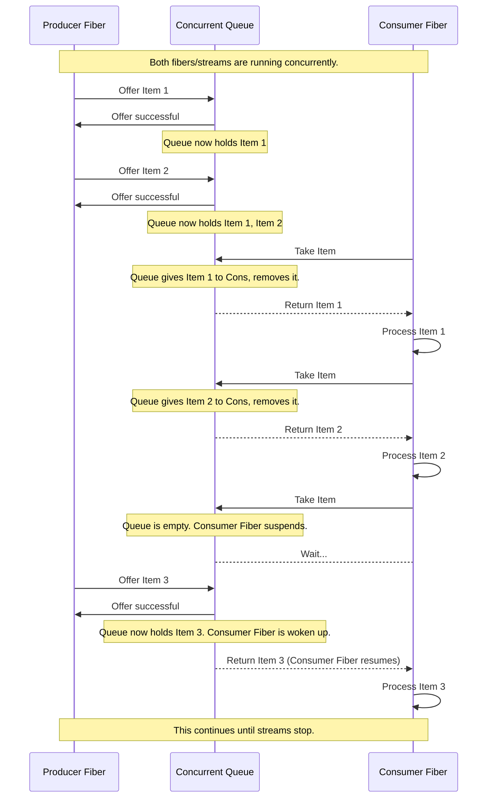
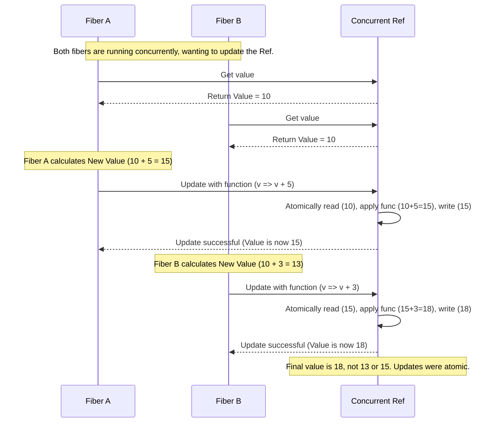
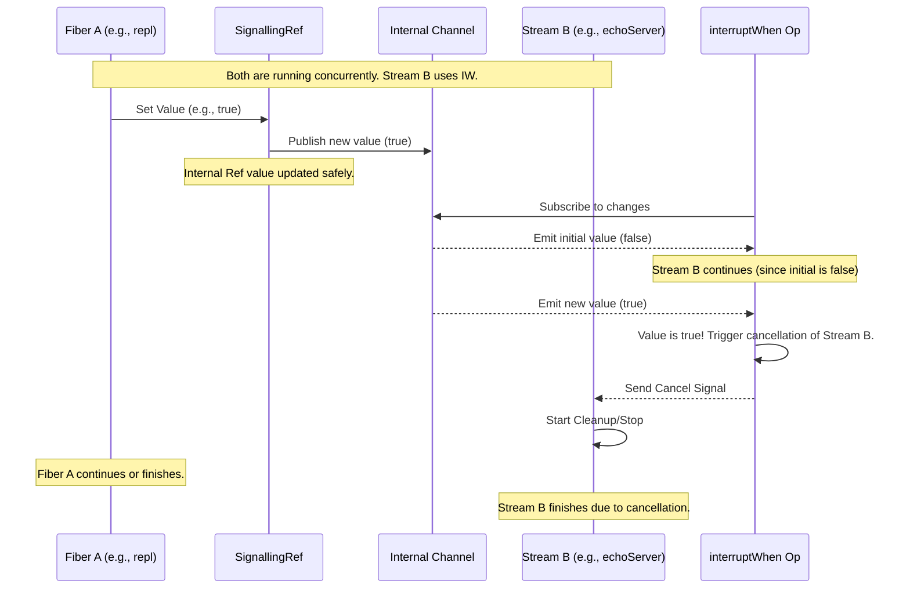

# Chapter 8: Concurrency Primitives (Queue, Ref, SignallingRef)

Welcome back! In [Chapter 7: Concurrency](07_concurrency_.md), we learned how to run multiple streams or effects seemingly at the same time using tools like `merge` and `parJoin`, or by `start`ing effects in the background. This is essential for responsive applications that handle many things at once.

However, when you have multiple concurrent tasks or streams running independently, they often need to communicate or share information safely. Imagine our multiple conveyor belts running side-by-side. How do items get from one belt to another? How do workers on different belts coordinate or check on a shared status?

Just letting multiple concurrent tasks access the same standard mutable variable (like a `var`) without careful synchronization is very dangerous. It can lead to subtle and hard-to-find bugs called **race conditions**, where the final outcome depends on the unpredictable exact timing of which task accesses the variable when.

This is where **Concurrency Primitives** come in. They are special thread-safe tools provided by effect libraries (like Cats Effect and ZIO) that allow concurrent tasks to communicate and coordinate reliably without needing low-level, error-prone synchronization code.

### What Problem Do Concurrency Primitives Solve?

Concurrency primitives provide safe ways for **independent fibers or concurrent stream operations** to interact. They are like agreed-upon, safe drop-off points or shared information boards that multiple workers (fibers/streams) can use without bumping into each other.

We'll look at three common and important primitives:

1.  **Queue:** A safe buffer to send data from one fiber/stream to another.
2.  **Ref:** A safe, mutable shared variable for keeping track of a single value (like a counter or status).
3.  **SignallingRef (FS2):** A special kind of `Ref` that makes it easy for one fiber to signal a boolean flag that others can efficiently observe and react to (like a stop button).

Let's explore each one.

### The Queue: A Safe Drop-off Point

Imagine you have one conveyor belt (a producer stream/fiber) generating items and another belt (a consumer stream/fiber) processing them. The producer shouldn't have to wait for the consumer to be ready for each item immediately, and the consumer shouldn't have to constantly check if the producer has an item.

A **Queue** acts as a buffer between them. The producer puts items *into* the queue, and the consumer takes items *from* the queue. The queue itself handles the coordination – if the queue is full (for bounded queues), the producer waits; if the queue is empty, the consumer waits. This happens automatically and safely.

Analogy: A mail drop box. The sender puts mail in (offers), the receiver picks mail up (takes). The drop box (the Queue) holds the mail in between.

FS2 provides `cats.effect.std.Queue[F, A]`, and ZIO provides `zio.Queue[A]` (where `A` is the type of items).

Look at `QueueExample.scala` and `zioVersion/QueueExample.scala`. They use a `Queue[IO, Int]` (FS2) or `Queue[Int]` (ZIO) to send integers from a `producer` stream to a `consumer` stream.

First, the Queue needs to be created within the effect `IO` or `ZIO`:

```scala
// Snippet from src/main/scala/QueueExample.scala (FS2)
import cats.effect.std.Queue // Need this import
import cats.effect.IO

// ... inside the run method's for comprehension ...
queue <- Stream.eval(Queue.unbounded[IO, Int]) // Create an unbounded queue in IO
ref <- Stream.eval(Ref.of[IO, Int](0)) // Create a Ref (we'll see this next)

// These are now available as 'queue' and 'ref' for the streams below
```

```scala
// Snippet from src/main/scala/zioVersion/QueueExample.scala (ZIO)
import zio.Queue // Need this import
import zio.{Queue, Ref, ZIO, UIO} // ZIO imports Ref too

// ... inside the run method's for comprehension ...
queue <- Queue.unbounded[Int] // Create an unbounded queue in ZIO
ref <- Ref.make(0) // Create a Ref (we'll see this next)

// These are now available as 'queue' and 'ref' for the streams below
```

`Queue.unbounded` creates a queue that can hold any number of items (limited only by memory). Bounded queues (`Queue.bounded(capacity)`) are also available and useful for preventing the producer from overwhelming the consumer.

Once the Queue is created, both the `producer` and `consumer` streams receive it and interact with it:

```scala
// Snippet from src/main/scala/QueueExample.scala (FS2)
private def producer(queue: Queue[IO, Int]): Stream[IO, Nothing] =
  Stream
    .iterate(0)(_ + 1)
    .covary[IO]
    .metered(100.millis)
    .evalMap(i => IO.println(s"Producing $i") *> queue.offer(i)) // Put item 'i' into the queue
    .drain

private def consumer(queue: Queue[IO, Int], ref: Ref[IO, Int]): Stream[IO, Nothing] =
  Stream
    .fromQueueUnterminated(queue) // Create a stream that takes items *from* the queue
    .evalMap(i => IO.println(s"Consuming $i") *> ref.update(_ + i)) // Process the item
    .drain
```

```scala
// Snippet from src/main/scala/zioVersion/QueueExample.scala (ZIO)
private def producer(queue: Queue[Int]): UStream[Nothing] =
  ZStream
    .iterate(0)(_ + 1)
    .schedule(Schedule.spaced(100.milliseconds))
    .mapZIO(i => Console.printLine(s"Producing $i").ignore *> queue.offer(i)) // Put item 'i' into the queue
    .drain

private def consumer(
    queue: Queue[Int],
    ref: Ref[Int]
): UStream[Nothing] =
  ZStream
    .fromQueue(queue) // Create a stream that takes items *from* the queue
    .mapZIO(i =>
        Console.printLine(s"Consuming $i").ignore *> ref.update(_ + i) // Process the item
      )
    .drain
```

Here's what's happening:

*   **Producer:** Uses `evalMap` (FS2) or `mapZIO` (ZIO) to perform an effect for each number `i`. This effect first prints, then calls `queue.offer(i)` (FS2) or `queue.offer(i)` (ZIO). This action safely puts `i` into the queue. `offer` is an effect (`IO[Unit]` or `ZIO[..., Unit]`).
*   **Consumer:** The stream starts with `Stream.fromQueueUnterminated(queue)` (FS2) or `ZStream.fromQueue(queue)` (ZIO). These are special stream sources that repeatedly call `queue.take` (or `queue.take`) internally. `queue.take` is also an effect (`IO[Int]` or `ZIO[..., Int]`) that *waits* until an item is available in the queue and then safely removes and returns it. The consumer's `evalMap`/`mapZIO` then processes the taken item `i`.

When the `producer` and `consumer` streams are run concurrently (via `merge` as seen in [Chapter 7: Concurrency](07_concurrency_.md)), the Queue allows them to operate at different paces, buffering items as needed.

**How the Queue Works Under the Hood (Simplified):**

A `Queue` internally manages a data structure (like a linked list) and uses low-level concurrency tools (like locks or atomic operations) to ensure that `offer` and `take` operations from multiple fibers/threads don't corrupt the queue's state. If `offer` is called on a full bounded queue or `take` is called on an empty queue, the fiber performing the operation is safely suspended until the operation can complete, without blocking the underlying OS thread.



### The Ref: A Safe Shared Variable

Sometimes you don't need to pass a stream of items, but rather just maintain a single piece of shared, mutable state that different concurrent tasks need to read or update. This could be a shared counter, a configuration setting that can change, or the current sum of processed items (like in the `QueueExample`).

A **Ref** provides a thread-safe way to manage such a shared, mutable variable within your effect system.

Analogy: A single sheet of paper on a shared desk with a number written on it. Workers can read the number, or update it (carefully, one at a time) using a safe process.

FS2 provides `cats.effect.std.Ref[F, A]`, and ZIO provides `zio.Ref[A]` (where `A` is the type of the value).

You create a `Ref` within your effect, providing an initial value:

```scala
// Snippet from src/main/scala/QueueExample.scala (FS2)
import cats.effect.std.Ref // Need this import
import cats.effect.IO

// ... inside the run method's for comprehension ...
queue <- Stream.eval(Queue.unbounded[IO, Int])
ref <- Stream.eval(Ref.of[IO, Int](0)) // Create a Ref[IO, Int] initialized to 0

// 'ref' is available to streams
```

```scala
// Snippet from src/main/scala/zioVersion/QueueExample.scala (ZIO)
import zio.Ref // Need this import
import zio.{Queue, Ref, ZIO, UIO}

// ... inside the run method's for comprehension ...
queue <- Queue.unbounded[Int]
ref <- Ref.make(0) // Create a Ref[Int] initialized to 0

// 'ref' is available to streams
```

Key operations on a Ref:

*   `get`: Safely read the current value. Returns `IO[A]` or `ZIO[..., A]`.
*   `set(newValue)`: Safely update the value. Returns `IO[Unit]` or `ZIO[..., Unit]`.
*   `update(f)`: Safely update the value based on its current value using a function `f: A => A`. This is atomic (reads the value, applies `f`, writes the new value as a single safe operation). Returns `IO[Unit]` or `ZIO[..., Unit]`.
*   `updateAndGet(f)` / `getAndUpdate(f)`: Atomic update with getting the new/old value.

In the `QueueExample`, the `consumer` stream updates the `ref` with the sum of consumed integers, and the `printSum` stream reads the final sum:

```scala
// Snippet from src/main/scala/QueueExample.scala (FS2)
private def consumer(queue: Queue[IO, Int], ref: Ref[IO, Int]): Stream[IO, Nothing] =
  Stream
    .fromQueueUnterminated(queue)
    .evalMap(i => IO.println(s"Consuming $i") *> ref.update(_ + i)) // Atomically update the ref: current_sum = current_sum + i
    .drain

private def printSum(ref: Ref[IO, Int]): Stream[IO, Unit] =
  Stream.eval(ref.get).flatMap(sum => Stream.eval(IO.println(s"Sum: $sum"))) // Safely read the ref value
```

```scala
// Snippet from src/main/scala/zioVersion/QueueExample.scala (ZIO)
private def consumer(
    queue: Queue[Int],
    ref: Ref[Int]
): UStream[Nothing] =
  ZStream
    .fromQueue(queue)
    .mapZIO(i =>
        Console.printLine(s"Consuming $i").ignore *> ref.update(_ + i) // Atomically update the ref: current_sum = current_sum + i
      )
    .drain

private def printSum(ref: Ref[Int]): UIO[Unit] =
  ref.get.flatMap(sum => Console.printLine(s"Sum: $sum").ignore) // Safely read the ref value
```

The `ref.update(_ + i)` call is crucial. It ensures that even if two consumer fibers were updating the same Ref simultaneously, the read-modify-write operation happens atomically. Without `update` (e.g., doing `ref.get.flatMap(current => ref.set(current + i))`), you could have a race condition where both fibers read the *same* `current` value before either writes back, causing one update to be lost.

**How the Ref Works Under the Hood (Simplified):**

A `Ref` typically uses compare-and-swap (CAS) operations provided by the Java/Scala platform or the underlying OS. This is a low-level hardware instruction that can atomcially update a memory location *only if* it still holds the value we expect it to hold. If the value has changed since we last read it, the CAS operation fails, and the `Ref` implementation retries the operation until it succeeds. This makes `get`, `set`, and `update` safe for concurrent access.



### SignallingRef (FS2): A Broadcast Flag

`SignallingRef[F, A]` (FS2 specific, available in `fs2.concurrent`) is built on top of `Ref[F, A]` but adds a crucial feature: a stream (`discrete`) that emits the `Ref`'s value *every time it changes*. This is particularly useful for boolean flags where one part of the program sets a flag (like `true` for "stop") and other parts need to react asynchronously whenever the flag changes.

Analogy: A large status light or flag visible across multiple workshops. One worker changes the flag (sets the Ref value). Other workers constantly watch the flag (subscribe to the `discrete` stream) and react immediately when it changes state.

`SignallingRef` is most commonly used with `Boolean` values (`SignallingRef[F, Boolean]`) for shutdown signals.

Look at `EchoServer.scala`. We need the main server stream to stop when the separate keyboard `repl` fiber receives the "KILLSERVER" command. A `SignallingRef[IO, Boolean]` is used for this.

First, create the `SignallingRef`, initialized to `false` (server not exiting):

```scala
// Snippet from src/main/scala/EchoServer.scala (FS2)
import fs2.concurrent.SignallingRef // Need this import
import cats.effect.IO

override def run: IO[Unit] =
  for
    _ <- IO.println("Hello, this is a simple echo server")
    // Create a SignallingRef[IO, Boolean] initialized to false
    serverExitSignal <- SignallingRef.apply[IO, Boolean](false)
    // ... rest of the code ...
```

The `repl` fiber gets access to this `serverExitSignal` and sets it to `true` when "KILLSERVER" is typed:

```scala
// Snippet from src/main/scala/EchoServer.scala (FS2)
private def repl[F[_]: Sync: Console](
    serverExitSignal: SignallingRef[F, Boolean] // Receives the ref
): F[Unit] =
  def loop: F[Unit] = for
    _ <- Console[F].println(">>> ")
    input <- Console[F].readLine
    _ <-
      if input == "KILLSERVER" then
        // Safely set the ref's value to true
        serverExitSignal
          .set(true) *> Console[F].println("Server told to exit")
      else Console[F].println(s"You entered: $input") *> loop
  yield ()

  loop
```

The main server stream (`echoServer`) uses the `SignallingRef`'s `discrete` stream combined with `interruptWhen` to stop running when the signal changes to `true`:

```scala
// Snippet from src/main/scala/EchoServer.scala (FS2)
private def echoServer[F[_]: Concurrent: Network: Console](
    serverExitSignal: SignallingRef[F, Boolean] // Receives the ref
) =
  Network[F]
    .server(port = Some(port"5555"))
    .map(handleClient[F])
    .parJoin(2)
    // Stop this stream whenever the serverExitSignal becomes true
    .interruptWhen(serverExitSignal) // serverExitSignal is SignallingRef[F, Boolean]
    .handleErrorWith { case KillServerException =>
      Stream.eval(
        Console[F].println("Server terminated by user")
      ) ++ Stream.empty // closes the server
    }
```

`interruptWhen` takes a `Stream[F, Boolean]`. The `discrete` stream of a `SignallingRef[F, Boolean]` is exactly this type. The `interruptWhen` operator subscribes to this stream and, when it emits `true`, it cancels the main server stream.

**How SignallingRef Works Under the Hood (Simplified):**

A `SignallingRef` wraps a `Ref`. When its value is changed via `set` or `update`, besides updating the internal `Ref` safely, it also pushes the new value into an internal communication channel (like a simplified `Queue` or `Topic`). The `discrete` stream is built by reading from this internal channel. Any stream using `interruptWhen(signallingRef)` is reading from this broadcast channel and triggers cancellation when `true` is received.



ZIO doesn't have a direct equivalent `SignallingRef`, but similar patterns can be built using `Ref[Boolean]` combined with `Hub` for broadcasting or `Promise` for a single signal. The `interruptAfter` operator in ZIO Streams is a convenience for duration-based cancellation, effectively using a background fiber and a time-based signal.

### Summary of Concurrency Primitives

Here's a quick comparison:

| Primitive     | Purpose                                     | State | Key Operations                       | FS2 Type         | ZIO Type       | Example Use Case                   |
| :------------ | :------------------------------------------ | :---- | :----------------------------------- | :--------------- | :------------- | :--------------------------------- |
| **Queue**     | Pass items between concurrent tasks/streams | Yes   | `offer`/`enqueue`, `take`/`dequeue`  | `Queue[F, A]`    | `Queue[A]`     | Producer/Consumer communication    |
| **Ref**       | Safe shared mutable single value            | Yes   | `get`, `set`, `update`               | `Ref[F, A]`      | `Ref[A]`       | Shared counter, status flag        |
| **SignallingRef**| Safe shared mutable boolean flag with stream observer | Yes | `get`, `set`, `update`, `discrete` | `SignallingRef[F, Boolean]` | (N/A directly) | Signalling shutdown, event flags   |

These primitives are fundamental building blocks for coordinating concurrent effectful code. They handle the complex synchronization details for you, allowing you to focus on the logic of your concurrent tasks.

### Concurrency Primitives in the Examples

You can see these primitives used in the example code:

*   `QueueExample.scala` / `zioVersion/QueueExample.scala`: Uses `Queue` to pass `Int` values from the `producer` stream to the `consumer` stream. Uses `Ref` to maintain the shared `sum` that the `consumer` updates and `printSum` reads.
*   `EchoServer.scala`: Uses `SignallingRef[IO, Boolean]` to signal the main server stream (`echoServer`) from the background keyboard loop fiber (`repl`) that it should shut down.

These examples demonstrate how to use these primitives to enable safe communication and coordination between parts of your application running concurrently.

### Conclusion

Building concurrent applications requires careful coordination between the tasks running at the same time. Concurrency primitives like `Queue`, `Ref`, and `SignallingRef` provide the necessary tools within the effect system to safely pass data, share mutable state, and signal events between concurrent streams and fibers. By using these primitives, you avoid the pitfalls of manual synchronization and race conditions, enabling you to build robust and correct concurrent programs.

This chapter concludes our initial exploration of the `fs2-examples` project and the core concepts behind building stream-based, effectful applications in Scala. You've learned about streams, effects, file I/O, transformations, running streams, error handling, concurrency, and now concurrency primitives. This gives you a solid foundation for understanding how these powerful libraries work together to build modern, performant, and reliable applications.

There's much more to explore, including different types of stream sources and sinks, advanced transformations, managing complex resources, testing techniques, and integrating with various services. We encourage you to look further into the FS2 and ZIO Streams documentation and experiment with these concepts in your own projects!

---

<sub><sup>**References**: [[1]](https://github.com/fancellu/fs2-examples/blob/d19af876ffe7973e915074614767f092f9680874/src/main/scala/EchoServer.scala), [[2]](https://github.com/fancellu/fs2-examples/blob/d19af876ffe7973e915074614767f092f9680874/src/main/scala/QueueExample.scala), [[3]](https://github.com/fancellu/fs2-examples/blob/d19af876ffe7973e915074614767f092f9680874/src/main/scala/zioVersion/QueueExample.scala)</sup></sub>