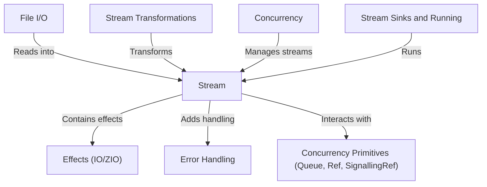

# Tutorial: fs2-examples

This project demonstrates building applications using *functional stream processing* libraries like FS2 and ZIO Streams. It focuses on processing sequences of data over time (called **Streams**), handling operations that have side effects (**Effects**), changing the data flow using **Stream Transformations**, executing the stream to produce results (**Stream Sinks and Running**), coordinating tasks running in parallel (**Concurrency** with **Concurrency Primitives**), dealing gracefully with errors (**Error Handling**), and performing operations like reading files (**File I/O**).

## Visual Overview

## Chapters

1. [Stream
   ](01_stream_.md)
2. [Effects (IO/ZIO)
   ](02_effects__io_zio__.md)
3. [File I/O
   ](03_file_i_o_.md)
4. [Stream Transformations
   ](04_stream_transformations_.md)
5. [Stream Sinks and Running
   ](05_stream_sinks_and_running_.md)
6. [Error Handling
   ](06_error_handling_.md)
7. [Concurrency
   ](07_concurrency_.md)
8. [Concurrency Primitives (Queue, Ref, SignallingRef)
   ](08_concurrency_primitives__queue__ref__signallingref__.md)
